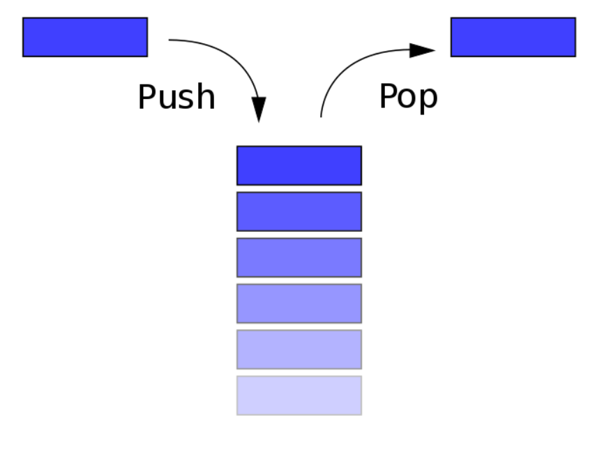

### 一、前言

又开始学习数据结构和算法了，一点一点深入。冰冻三尺非一日之寒，滴水石穿非一日之功，自勉。

数据结构是在计算机中组织和存储数据的一种特殊方式，使得数据可以高效地被访问和修改。更确切地说，数据结构是数据值的集合，表示数据之间的关系，也包括了作用在数据上的函数或操作。

先概况一下栈、队列和堆的不同:

- 栈=堆栈(栈的别名)  !=  堆
- 栈(堆栈)(Stack): 先进后出
- 队列(Queue): 先进先出
- 堆(Heap): 二叉树

### 二、概念

栈是一个线性结构，用作表示元素的集合。可将它类比于一组物体的堆叠(一摞书,一摞盘子之类的)，最大的特点是只能在某一端添加或删除数据，遵循先进后出的原则。此外，应有一个 peek 操作用于访问栈当前顶端(末尾)的元素。

栈的基本操作包括创建栈、销毁栈、出栈、入栈、获取栈顶元素、获取栈的大小、清空栈。
**栈和堆栈是一个概念。**



### 三、实现

可以把栈看成是数组的一个子集，所以这里使用数组来实现它。

```
class Stack {
    constructor() {
        this.stack = [] // 初始化为空
    }
    // 入栈
    push(item) {
        this.stack.push(item)
    }
    // 出栈
    pop() {
        this.stack.pop()
    }
    // peek查看栈顶元素
    peek() {
        return this.stack[this.getCount() - 1]
    }
    // 返回栈内元素总数
    getCount() {
        return this.stack.length
    }
    // 清空栈
    clear() {
        this.stack = [];
    }
}

// 初始化一个栈
var stack = new Stack();
stack.push('a');
stack.push('b');
console.log(stack.getCount());
console.log(stack.peek());
stack.pop();
stack.push('c');
stack.clear();
console.log(stack);
```
