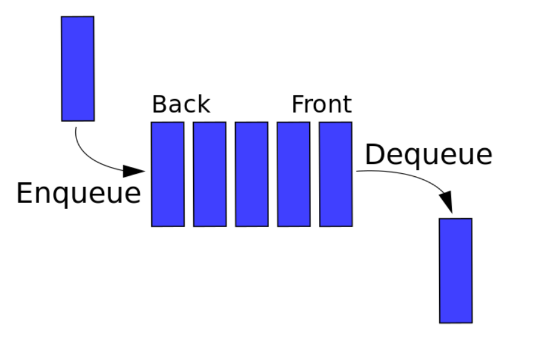

### 一、概念

在计算机科学中, 一个 队列(queue) 是一种特殊类型的抽象数据类型或集合。集合中的实体按顺序保存(线性结构)。

它的基本操作有两种: 向队列的后端位置添加实体，称为入队，并从队列的前端位置移除实体，称为出队。 遵循先进先出的原则。



### 二、实现

```
class Queue {
    constructor() {
        this.queue = []
    }
    enQueue(item) {
        this.queue.push(item);
    }
    deQueue() {
        return this.queue.shift();
    }
    getHeader() {
        return this.queue[0];
    }
    getTail() {
        return this.queue[this.queue.length - 1];
    }
    getLength() {
        return this.queue.length;
    }
    isEmpty() {
        return this.getLength() === 0;
    }
    clear() {
        this.queue = [];
    }
}

let queue = new Queue();
queue.enQueue('a');
queue.enQueue('b');
queue.enQueue('c');
console.log(queue.getHeader());
console.log(queue.getTail());
console.log(queue.getLength());
queue.deQueue();
console.log(queue);
queue.clear();
console.log(queue.isEmpty());
```

单链队列在出队操作的时候的时间复杂度为 O(n)。
