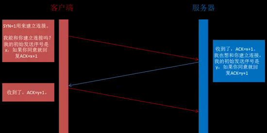
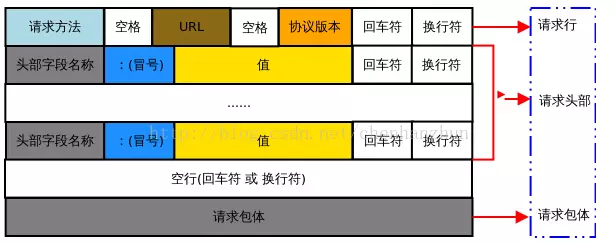
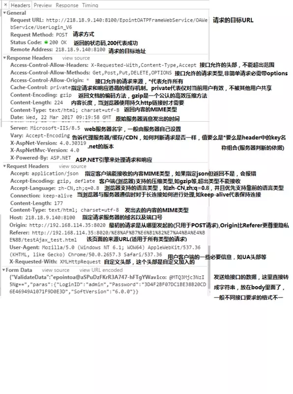
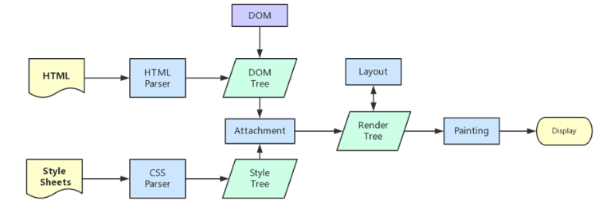
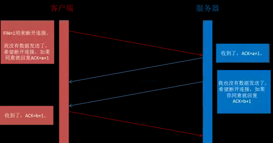

## 简述

1. 浏览器的地址栏输入URL并按下回车。
2. 浏览器查找当前URL是否存在缓存，并比较缓存是否过期。
3. DNS解析URL对应的IP。
4. 根据IP建立TCP连接（三次握手）。
5. HTTP发起请求。
6. 服务器处理请求，浏览器接收HTTP响应。
7. 浏览器解析渲染页面。
8. 关闭TCP连接（四次挥手）。

## 过程

### 1 输入URL并按下回车

url一般包含这几个知识点：

协议：主要是HTTP协议，HTTPS协议，FTP协议，FILe协议
域名： 定义因特网域名，比如 google.com
端口号：通常默认都是隐藏的 http默认端口号为80 https默认端口号为443
补充: 同源策略 - 在前端进行数据请求时，由于浏览器的同源策略，协议，域名，端口号有一个不同会存在跨域请求，需要进行跨域处理

### 2 浏览器查找当前URL是否存在缓存，并比较缓存是否过期

浏览器首先查询当前URL是否有缓存,有的话,再查询是否过期,没过期则读缓存.过期了则访问web服务器.

强缓存、协商缓存、缓存位置

### 3 DNS解析URL对应的IP

解析过程:

1.首先浏览器会查看自己的DNS缓存是否存在.
2.如果没有找到,浏览器会先查找本地hosts文件是否有这个网址映射关系，如果有就调用这个IP地址映射，完成域名解析。
3.如果没有找到,则会在操作系统缓存中查找本地的DNS解析器缓存，如果找到则返回。
4.如果没有找到,则会在路由器缓存中进行查找,如果找到则返回。
5.如果还是没有找到,则会按ISP(运营商)DNS缓存、根域名服务器、顶级域名服务器、主域名服务器的顺序，逐步读取缓存，直到拿到IP地址.

为什么要DNS解析

互联网上每一台计算机的唯一标识是它的IP地址，但是IP地址并不方便记忆。用户更喜欢用方便记忆的网址去寻找互联网上的其它计算机，也就是上面提到的百度的网址。所以互联网设计者需要在用户的方便性与可用性方面做一个权衡，这个权衡就是一个网址到IP地址的转换，这个过程就是DNS解析，即实现了网址到IP地址的转换

IP 地址

IP 地址是指互联网协议地址，是 IP Address 的缩写。IP 地址是 IP 协议提供的一种统一的地址格式，它为互联网上的每一个网络和每一台主机分配一个逻辑地址，以此来屏蔽物理地址的差异。IP 地址是一个 32 位的二进制数，比如 127.0.0.1 为本机 IP。

域名就相当于 IP 地址乔装打扮的伪装者，带着一副面具。它的作用就是便于记忆和沟通的一组服务器的地址。用户通常使用主机名或域名来访问对方的计算机，而不是直接通过 IP 地址访问。因为与 IP 地址的一组纯数字相比，用字母配合数字的表示形式来指定计算机名更符合人类的记忆习惯。但要让计算机去理解名称，相对而言就变得困难了。因为计算机更擅长处理一长串数字。为了解决上述的问题，DNS 服务应运而生。

什么是域名解析

DNS 协议提供通过域名查找 IP 地址，或逆向从 IP 地址反查域名的服务。DNS 是一个网络服务器，我们的域名解析简单来说就是在 DNS 上记录一条信息记录。

例如 baidu.com  220.114.23.56（服务器外网IP地址）80（服务器端口号）

### 4 根据IP建立TCP连接（三次握手）

三次握手的过程:
客户端发送一个syn包:即带有 SYN=1，Seq=x 的数据包到服务器端口，并进入SYN_SENT状态，等待服务器确认；（第一次握手，由浏览器发起，告诉服务器我要发送请求了）
服务器收到syn包，必须确认客户的SYN，同时发回一个带 SYN=1， ACK=x+1， Seq=y 的响应包以示传达确认信息,即SYN+ACK包，此时服务器进入SYN_RECV状态；（第二次握手，由服务器发起，告诉浏览器我准备接受了，你赶紧发送吧）
客户端收到服务器的SYN+ACK包，向服务器发送确认包ACK,即回传一个带 ACK=y+1， Seq=Z 的数据包，代表“握手结束”（第三次握手，由浏览器发送，告诉服务器，我马上就发了，准备接受吧）



完成TCP连接后开使向服务器进行请求

三次握手是为了防止已失效的连接请求报文段突然又传送到了服务端，因而产生错误

### 5 HTTP发起请求

### 6 服务器处理请求，浏览器接收HTTP响应

发送请求，分析 url，设置请求报文(头，主体)
服务器返回请求的文件 (html)

================================================================

完整的HTTP请求包含请求起始行、请求头部、请求主体三部分。



- 服务器在收到浏览器发送的HTTP请求之后，会将收到的HTTP报文封装成HTTP的Request对象，并通过不同的Web服务器进行处理，处理完的结果以HTTP的Response对象返回，主要包括状态码，响应头，响应报文三个部分。
- 综合起来,完整的HTTP请报文一般包括了：通用头部，请求/响应头部，请求/响应体

通用头部

```
//General

Request Url: 请求的web服务器地址

Request Method: 请求方式
（Get、POST、OPTIONS、PUT、HEAD、DELETE、CONNECT、TRACE）

Status Code: 请求的返回状态码，如200代表成功

Remote Address: 请求的远程服务器地址（会转为IP）

Referrer Policy: (引用策略)用来监管哪些访问来源信息 (IE暂不支持)
```

请求/响应头部:

常用的请求头部（部分）：
```
Accept: 接收类型，表示浏览器支持的MIME类型
（对标服务端返回的Content-Type）
Accept-Encoding：浏览器支持的压缩类型,如gzip等,超出类型不能接收
Content-Type：客户端发送出去实体内容的类型
Cache-Control: 指定请求和响应遵循的缓存机制，如no-cache
If-Modified-Since：对应服务端的Last-Modified，用来匹配看文件是否变动，只能精确到1s之内，http1.0中
Expires：缓存控制，在这个时间内不会请求，直接使用缓存，http1.0，而且是服务端时间
Max-age：代表资源在本地缓存多少秒，有效时间内不会请求，而是使用缓存，http1.1中
If-None-Match：对应服务端的ETag，用来匹配文件内容是否改变（非常精确），http1.1中
Cookie: 有cookie并且同域访问时会自动带上
Connection: 当浏览器与服务器通信时对于长连接如何进行处理,如keep-alive
Host：请求的服务器URL
Origin：最初的请求是从哪里发起的（只会精确到端口）,Origin比Referer更尊重隐私
Referer：该页面的来源URL(适用于所有类型的请求，会精确到详细页面地址，csrf拦截常用到这个字段)
User-Agent：用户客户端的一些必要信息，如UA头部等
```

常用的响应头部（部分）：
```
Access-Control-Allow-Headers: 服务器端允许的请求Headers
Access-Control-Allow-Methods: 服务器端允许的请求方法
Access-Control-Allow-Origin: 服务器端允许的请求Origin头部（譬如为*）
Content-Type：服务端返回的实体内容的类型
Date：数据从服务器发送的时间
Cache-Control：告诉浏览器或其他客户，什么环境可以安全的缓存文档
Last-Modified：请求资源的最后修改时间
Expires：应该在什么时候认为文档已经过期,从而不再缓存它
Max-age：客户端的本地资源应该缓存多少秒，开启了Cache-Control后有效
ETag：请求变量的实体标签的当前值
Set-Cookie：设置和页面关联的cookie，服务器通过这个头部把cookie传给客户端
Keep-Alive：如果客户端有keep-alive，服务端也会有响应（如timeout=38）
Server：服务器的一些相关信息
```

一般来说，请求头部和响应头部是匹配分析的。

譬如，请求头部的Accept要和响应头部的Content-Type匹配，否则会报错;
譬如，跨域请求时，请求头部的Origin要匹配响应头部的Access-Control-Allow-Origin，否则会报跨域错误;
譬如，在使用缓存时，请求头部的If-Modified-Since、If-None-Match分别和响应头部的Last-Modified、ETag对应;

请求/响应实体:

http请求时，除了头部，还有消息实体，一般来说

请求实体中会将一些需要的参数都放入进入（用于post请求）。

譬如实体中可以放参数的序列化形式（a=1&b=2这种），或者直接放表单对象（Form Data对象，上传时可以夹杂参数以及文件），等等

而一般响应实体中，就是放服务端需要传给客户端的内容

一般现在的接口请求时，实体中就是对于的信息的json格式，而像页面请求这种，里面就是直接放了一个html字符串，然后浏览器自己解析并渲染。



### 7 浏览器解析渲染页面

流程简述

1. 解析HTML，构建DOM树
2. 解析CSS，生成CSS规则树
3. 合并DOM树和CSS规则，生成render树
4. 布局render树（Layout/reflow），负责各元素尺寸、位置的计算
5. 绘制render树（paint），绘制页面像素信息
6. 浏览器会将各层的信息发送给GPU，GPU会将各层合成（composite），显示在屏幕上
PS:

reflow：也称作layout，中文叫回流，一般意味着元素的内容、结构、位置或尺寸发生了变化，需要重新计算样式和渲染树，这个过程称为reflow。

repaint：中文重绘，意味着元素发生的改变只是影响了元素的一些外观之类的时候(例如：背景色，边框颜色，文字颜色等)，此时只需要应用新样式绘制这个元素就可以了。

(1).根据 HTML 解析 DOM 树

根据 HTML 的内容，将标签按照结构解析成为 DOM 树，DOM 树解析的过程是一个深度优先遍历。即先构建当前节点的所有子节点，再构建下一个兄弟节点。
在读取 HTML 文档，构建 DOM 树的过程中，若遇到 script 标签，则 DOM 树的构建会暂停，直至脚本执行完毕。

(2).根据 CSS 解析生成 CSS 规则树

解析 CSS 规则树时 js 执行将暂停，直至 CSS 规则树就绪。
浏览器在 CSS 规则树生成之前不会进行渲染。

(3).结合 DOM 树和 CSS 规则树，生成渲染树

DOM 树和 CSS 规则树全部准备好了以后，浏览器才会开始构建渲染树。
精简 CSS 并可以加快 CSS 规则树的构建，从而加快页面相应速度。

(4).根据渲染树计算每一个节点的信息（布局）

布局：通过渲染树中渲染对象的信息，计算出每一个渲染对象的位置和尺寸
回流：在布局完成后，发现了某个部分发生了变化影响了布局，那就需要倒回去重新渲染。

(5).根据计算好的信息绘制页面

绘制阶段，系统会遍历呈现树，并调用呈现器的“paint”方法，将呈现器的内容显示在屏幕上。
重绘：某个元素的背景颜色，文字颜色等，不影响元素周围或内部布局的属性，将只会引起浏览器的重绘。
回流：某个元素的尺寸发生了变化，则需重新计算渲染树，重新渲染。



### 8 关闭TCP连接（四次挥手）

通过四次挥手关闭连接(FIN ACK, ACK, FIN ACK, ACK)。



第一次挥手：Client发送一个FIN，用来关闭Client到Server的数据传送，Client进入FIN_WAIT_1状态。(第一次挥手：由浏览器发起的，发送给服务器，我请求报文发送完了，你准备关闭吧)

第二次挥手：Server收到FIN后，发送一个ACK给Client，确认序号为收到序号+1（与SYN相同，一个FIN占用一个序号），Server进入CLOSE_WAIT状态。(第二次挥手：由服务器发起的，告诉浏览器，我请求报文接受完了，我准备关闭了，你也准备吧)

第三次挥手：Server发送一个FIN，用来关闭Server到Client的数据传送，Server进入LAST_ACK状态。(第三次挥手：由服务器发起，告诉浏览器，我响应报文发送完了，你准备关闭吧)

第四次挥手：Client收到FIN后，Client进入TIME_WAIT状态，接着发送一个ACK给Server，确认序号为收到序号+1，Server进入CLOSED状态，完成四次挥手。(第四次挥手：由浏览器发起，告诉服务器，我响应报文接受完了，我准备关闭了，你也准备吧)
