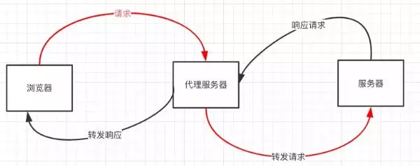

## 简述

- jsonp
- cors
- postMessage
- websocket
- Node中间件代理(两次跨域)
- nginx反向代理
- window.name + iframe
- location.hash + iframe
- document.domain + iframe

- CORS支持所有类型的HTTP请求，是跨域HTTP请求的根本解决方案
- JSONP只支持GET请求，JSONP的优势在于支持老式浏览器，以及可以向不支持CORS的网站请求数据。
- 不管是Node中间件代理还是nginx反向代理，主要是通过同源策略对服务器不加限制。
- 日常工作中，用得比较多的跨域方案是cors和nginx反向代理

## 方式

### 一、jsonp

1. JSONP原理
利用 <script> 标签没有跨域限制的漏洞，网页可以得到从其他来源动态产生的 JSON 数据。JSONP请求一定需要对方的服务器做支持才可以。

2. JSONP和AJAX对比
JSONP和AJAX相同，都是客户端向服务器端发送请求，从服务器端获取数据的方式。但AJAX属于同源策略，JSONP属于非同源策略（跨域请求）

3. JSONP优缺点
JSONP优点是简单兼容性好，可用于解决主流浏览器的跨域数据访问的问题。缺点是仅支持get方法具有局限性,不安全可能会遭受XSS攻击。

4. 实现
```
// index.html
function jsonp({ url, params, callback }) {
  return new Promise((resolve, reject) => {
    let script = document.createElement('script')
    window[callback] = function(data) {
      resolve(data)
      document.body.removeChild(script)
    }
    params = { ...params, callback } // wd=b&callback=show
    let arrs = []
    for (let key in params) {
      arrs.push(`${key}=${params[key]}`)
    }
    script.src = `${url}?${arrs.join('&')}`
    document.body.appendChild(script)
  })
}
jsonp({
  url: 'http://localhost:3000/say',
  params: { wd: 'Iloveyou' },
  callback: 'show'
}).then(data => {
  console.log(data)
})
```
上面这段代码相当于向http://localhost:3000/say?wd=Iloveyou&callback=show这个地址请求数据，然后后台返回show('我也爱你')，最后会运行show()这个函数，打印出'我也爱你'

```
// server.js
let express = require('express')
let app = express()
app.get('/say', function(req, res) {
  let { wd, callback } = req.query
  console.log(wd) // Iloveyou
  console.log(callback) // show
  res.end(`${callback}('我不爱你')`)
})
app.listen(3000)
```

### 二、cors

CORS 需要浏览器和后端同时支持。IE 8 和 9 需要通过 XDomainRequest 来实现。

浏览器会自动进行 CORS 通信，实现 CORS 通信的关键是后端。只要后端实现了 CORS，就实现了跨域。
服务端设置 Access-Control-Allow-Origin 就可以开启 CORS。 该属性表示哪些域名可以访问资源，如果设置通配符则表示所有网站都可以访问资源。

### 三、postMessage

postMessage是HTML5 XMLHttpRequest Level 2中的API，且是为数不多可以跨域操作的window属性之一，它可用于解决以下方面的问题：
页面和其打开的新窗口的数据传递
多窗口之间消息传递
页面与嵌套的iframe消息传递
上面三个场景的跨域数据传递

postMessage()方法允许来自不同源的脚本采用异步方式进行有限的通信，可以实现跨文本档、多窗口、跨域消息传递。
```
otherWindow.postMessage(message, targetOrigin, [transfer]);
```

```
// a.html
  <iframe src="http://localhost:4000/b.html" frameborder="0" id="frame" onload="load()"></iframe> //等它加载完触发一个事件
  //内嵌在http://localhost:3000/a.html
    <script>
      function load() {
        let frame = document.getElementById('frame')
        frame.contentWindow.postMessage('我爱你', 'http://localhost:4000') //发送数据
        window.onmessage = function(e) { //接受返回数据
          console.log(e.data) //我也爱你
        }
      }
    </script>
```

```
// b.html
  window.onmessage = function(e) {
    console.log(e.data) //我爱你
    e.source.postMessage('我也爱你', e.origin)
 }
```

### 四、websocket

Websocket是HTML5的一个持久化的协议，它实现了浏览器与服务器的全双工通信，同时也是跨域的一种解决方案。WebSocket和HTTP都是应用层协议，都基于 TCP 协议。但是 WebSocket 是一种双向通信协议，在建立连接之后，WebSocket 的 server 与 client 都能主动向对方发送或接收数据。同时，WebSocket 在建立连接时需要借助 HTTP 协议，连接建立好了之后 client 与 server 之间的双向通信就与 HTTP 无关了。

原生WebSocket API使用起来不太方便，我们使用Socket.io

```
// socket.html
<script>
    let socket = new WebSocket('ws://localhost:3000');
    socket.onopen = function () {
      socket.send('我爱你');//向服务器发送数据
    }
    socket.onmessage = function (e) {
      console.log(e.data);//接收服务器返回的数据
    }
</script>
// server.js
let express = require('express');
let app = express();
let WebSocket = require('ws');//记得安装ws
let wss = new WebSocket.Server({port:3000});
wss.on('connection',function(ws) {
  ws.on('message', function (data) {
    console.log(data);
    ws.send('我不爱你')
  });
})
```

### 五、Node中间件代理(两次跨域)

实现原理：同源策略是浏览器需要遵循的标准，而如果是服务器向服务器请求就无需遵循同源策略。
代理服务器，需要做以下几个步骤：
- 接受客户端请求
- 将请求 转发给服务器
- 拿到服务器 响应 数据
- 将 响应 转发给客户端
  


本地文件index.html文件，通过代理服务器http://localhost:3000向目标服务器http://localhost:4000请求数据。
```
// index.html(http://127.0.0.1:5500)
 <script src="https://cdn.bootcss.com/jquery/3.3.1/jquery.min.js"></script>
    <script>
      $.ajax({
        url: 'http://localhost:3000',
        type: 'post',
        data: { name: 'xiamen', password: '123456' },
        contentType: 'application/json;charset=utf-8',
        success: function(result) {
          console.log(result) // {"title":"fontend","password":"123456"}
        },
        error: function(msg) {
          console.log(msg)
        }
      })
     </script>
// server1.js 代理服务器(http://localhost:3000)
const http = require('http')
// 第一步：接受客户端请求
const server = http.createServer((request, response) => {
  // 代理服务器，直接和浏览器直接交互，需要设置CORS 的首部字段
  response.writeHead(200, {
    'Access-Control-Allow-Origin': '*',
    'Access-Control-Allow-Methods': '*',
    'Access-Control-Allow-Headers': 'Content-Type'
  })
  // 第二步：将请求转发给服务器
  const proxyRequest = http
    .request(
      {
        host: '127.0.0.1',
        port: 4000,
        url: '/',
        method: request.method,
        headers: request.headers
      },
      serverResponse => {
        // 第三步：收到服务器的响应
        var body = ''
        serverResponse.on('data', chunk => {
          body += chunk
        })
        serverResponse.on('end', () => {
          console.log('The data is ' + body)
          // 第四步：将响应结果转发给浏览器
          response.end(body)
        })
      }
    )
    .end()
})
server.listen(3000, () => {
  console.log('The proxyServer is running at http://localhost:3000')
})
// server2.js(http://localhost:4000)
const http = require('http')
const data = { title: 'fontend', password: '123456' }
const server = http.createServer((request, response) => {
  if (request.url === '/') {
    response.end(JSON.stringify(data))
  }
})
server.listen(4000, () => {
  console.log('The server is running at http://localhost:4000')
})
```
上述代码经过两次跨域，值得注意的是浏览器向代理服务器发送请求，也遵循同源策略，最后在index.html文件打印出{"title":"fontend","password":"123456"}

### nginx反向代理

实现原理类似于Node中间件代理，需要你搭建一个中转nginx服务器，用于转发请求。

使用nginx反向代理实现跨域，是最简单的跨域方式。只需要修改nginx的配置即可解决跨域问题，支持所有浏览器，支持session，不需要修改任何代码，并且不会影响服务器性能。

实现思路：通过nginx配置一个代理服务器（域名与domain1相同，端口不同）做跳板机，反向代理访问domain2接口，并且可以顺便修改cookie中domain信息，方便当前域cookie写入，实现跨域登录。

先下载nginx，然后将nginx目录下的nginx.conf修改如下:
```
// proxy服务器
server {
    listen 80;
    server_name www.domain1.com;
    location / {
        proxy_pass http://www.domain2.com:8080; #反向代理
        proxy_cookie_domain www.domain2.com www.domain1.com; #修改cookie里域名
        index index.html index.htm;

        # 当用webpack-dev-server等中间件代理接口访问nignx时，此时无浏览器参与，故没有同源限制，下面的跨域配置可不启用
        add_header Access-Control-Allow-Origin http://www.domain1.com; #当前端只跨域不带cookie时，可为*
        add_header Access-Control-Allow-Credentials true;
    }
}
```
最后通过命令行nginx -s reload启动nginx

补充一个: vue项目打包部署配置
```
	
#user  nobody;
worker_processes  1;

#error_log  logs/error.log;
#error_log  logs/error.log  notice;
#error_log  logs/error.log  info;

#pid        logs/nginx.pid;


events {
    worker_connections  1024;
}


http {
    include       mime.types;
    default_type  application/octet-stream;

    #log_format  main  '$remote_addr - $remote_user [$time_local] "$request" '
    #                  '$status $body_bytes_sent "$http_referer" '
    #                  '"$http_user_agent" "$http_x_forwarded_for"';

    #access_log  logs/access.log  main;

    sendfile        on;
    #tcp_nopush     on;

    #keepalive_timeout  0;
    keepalive_timeout  65;
    # 配置nginx上传文件最大限制
    client_max_body_size 50m;
    #gzip  on;

    server {
        listen       80;
        server_name  localhost;

        #charset koi8-r;

        #access_log  logs/host.access.log  main;

        location / {
            root   html;
            index  index.html index.htm;
        }

        #error_page  404              /404.html;

        # redirect server error pages to the static page /50x.html
        #
        error_page   500 502 503 504  /50x.html;
        location = /50x.html {
            root   html;
        }

        # proxy the PHP scripts to Apache listening on 127.0.0.1:80
        #
        #location ~ \.php$ {
        #    proxy_pass   http://127.0.0.1;
        #}

        # pass the PHP scripts to FastCGI server listening on 127.0.0.1:9000
        #
        #location ~ \.php$ {
        #    root           html;
        #    fastcgi_pass   127.0.0.1:9000;
        #    fastcgi_index  index.php;
        #    fastcgi_param  SCRIPT_FILENAME  /scripts$fastcgi_script_name;
        #    include        fastcgi_params;
        #}

        # deny access to .htaccess files, if Apache's document root
        # concurs with nginx's one
        #
        #location ~ /\.ht {
        #    deny  all;
        #}
    }

# 政企通PC-测试
    server {
        listen       8305 default_server;
       server_name  _;
    root         /html/policy_enterprise_pc/dist;
    index index.html;

        # Load configuration files for the default server block.
        include /usr/local/nginx/*.conf;

    location / {
      try_files $uri $uri/ /index.html;
        }

        location ^~/apiHost/ {
            proxy_pass http://172.16.26.5:8020/;
            break;
        }

        location ^~/uedHost/ {
            proxy_pass http://47.110.250.241:8030/ueditor/;
            break;
        }

        error_page 404 /404.html;
            location = /40x.html {
        }

        error_page 500 502 503 504 /50x.html;
            location = /50x.html {
        }
    }


# 经信局后台管理——平台
    server {
        listen       8310 default_server;
        server_name  _;
        root  /html/jxj-admin/dist;
        index index.html;

        # Load configuration files for the default server block.
        include /usr/local/nginx/*.conf;

        location / {
            try_files $uri $uri/ /index.html;
        }
        location ^~/api/ {
            proxy_pass http://172.16.26.5:9001/;
            break;
        }

        error_page 404 /404.html;
            location = /40x.html {
        }

        error_page 500 502 503 504 /50x.html;
            location = /50x.html {
        }
    }

    # another virtual host using mix of IP-, name-, and port-based configuration
    #
    #server {
    #    listen       8000;
    #    listen       somename:8080;
    #    server_name  somename  alias  another.alias;

    #    location / {
    #        root   html;
    #        index  index.html index.htm;
    #    }
    #}


    # HTTPS server
    #
    #server {
    #    listen       443 ssl;
    #    server_name  localhost;

    #    ssl_certificate      cert.pem;
    #    ssl_certificate_key  cert.key;

    #    ssl_session_cache    shared:SSL:1m;
    #    ssl_session_timeout  5m;

    #    ssl_ciphers  HIGH:!aNULL:!MD5;
    #    ssl_prefer_server_ciphers  on;

    #    location / {
    #        root   html;
    #        index  index.html index.htm;
    #    }
    #}
}

```

### 七、window.name + iframe

window.name属性的独特之处：name值在不同的页面（甚至不同域名）加载后依旧存在，并且可以支持非常长的 name 值（2MB）。

其中a.html和b.html是同域的，都是http://localhost:3000;而c.html是http://localhost:4000
```
// a.html(http://localhost:3000/b.html)
  <iframe src="http://localhost:4000/c.html" frameborder="0" onload="load()" id="iframe"></iframe>
  <script>
    let first = true
    // onload事件会触发2次，第1次加载跨域页，并留存数据于window.name
    function load() {
      if(first){
      // 第1次onload(跨域页)成功后，切换到同域代理页面
        let iframe = document.getElementById('iframe');
        iframe.src = 'http://localhost:3000/b.html';
        first = false;
      }else{
      // 第2次onload(同域b.html页)成功后，读取同域window.name中数据
        console.log(iframe.contentWindow.name);
      }
    }
  </script>
```

b.html为中间代理页，与a.html同域，内容为空。
```
// c.html(http://localhost:4000/c.html)
  <script>
    window.name = '我也爱你'
  </script>
```
总结：通过iframe的src属性由外域转向本地域，跨域数据即由iframe的window.name从外域传递到本地域。这个就巧妙地绕过了浏览器的跨域访问限制，但同时它又是安全操作。

### 八、location.hash + iframe

实现原理： a.html欲与c.html跨域相互通信，通过中间页b.html来实现。 三个页面，不同域之间利用iframe的location.hash传值，相同域之间直接js访问来通信。

具体实现步骤：一开始a.html给c.html传一个hash值，然后c.html收到hash值后，再把hash值传递给b.html，最后b.html将结果放到a.html的hash值中。
同样的，a.html和b.html是同域的，都是http://localhost:3000;而c.html是http://localhost:4000

```
// a.html
  <iframe src="http://localhost:4000/c.html#iloveyou"></iframe>
  <script>
    window.onhashchange = function () { //检测hash的变化
      console.log(location.hash);
    }
  </script>
// b.html
  <script>
    window.parent.parent.location.hash = location.hash
    //b.html将结果放到a.html的hash值中，b.html可通过parent.parent访问a.html页面
  </script>
// c.html
 console.log(location.hash);
  let iframe = document.createElement('iframe');
  iframe.src = 'http://localhost:3000/b.html#idontloveyou';
  document.body.appendChild(iframe);
```

### 九、document.domain + iframe

该方式只能用于二级域名相同的情况下，比如 a.test.com 和 b.test.com 适用于该方式。

只需要给页面添加 document.domain ='test.com' 表示二级域名都相同就可以实现跨域。
实现原理：两个页面都通过js强制设置document.domain为基础主域，就实现了同域。

我们看个例子：页面a.zf1.cn:3000/a.html获取页面b.zf1.cn:3000/b.html中a的值
```
// a.html
<body>
 helloa
  <iframe src="http://b.zf1.cn:3000/b.html" frameborder="0" onload="load()" id="frame"></iframe>
  <script>
    document.domain = 'zf1.cn'
    function load() {
      console.log(frame.contentWindow.a);
    }
  </script>
</body>
```

```
// b.html
<body>
   hellob
   <script>
     document.domain = 'zf1.cn'
     var a = 100;
   </script>
</body>
```
