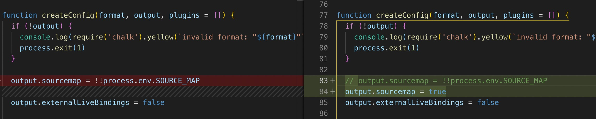
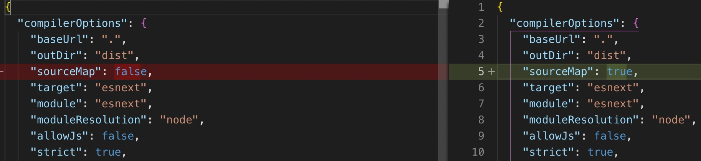

### 前言

vue3 beta 版已经出来一段时间了，在尝试了vue3 的 composition-api 后，忍不住想要研究一下源码(嘴上喊着学不动🐶🐶)，向尤大学习。

当前学习版本：[v3.0.0-rc.5](https://github.com/vuejs/vue-next/releases/tag/v3.0.0-rc.5)

### 如何调试Vue3源码

1. 下载源码
2. 安装依赖

```dotnetcli
yarn
```

3. 修改配置

安装完yarn和依赖后, 在项目中找到rollup.config.js文件, 修改 output.sourcemap = true


然后在tsconfig.json文件把"sourceMap": false改成"sourceMap": true


4. 编译运行

```dotnetcli
yarn dev (npm run dev)
```

5. 根目录新增测试页面 demo/01-test.html

打开浏览器控制台打断点进行调试

```
<!DOCTYPE html>
<html lang="en">

<head>
    <meta charset="UTF-8">
    <meta name="viewport" content="width=device-width, initial-scale=1.0">
    <meta http-equiv="X-UA-Compatible" content="ie=edge">
    <title>Document</title>
    <script src="../packages/vue/dist/vue.global.js"></script>
</head>

<body>
    <div id="app">
        {{ message }}
    </div>

    <script>
        const { createApp, ref } = Vue;
        const App = {
            setup() {
                const message = ref('Hello Vue3 !');
                return {
                    message
                }
            }
        };
        createApp(App).mount('#app');
    </script>
</body>

</html>
```

如果需要利用Vue3里的测试案例:
```dotnetcli
＃运行所有测试
yarn test

＃在监视模式下运行测试
yarn test --watch

＃在runtime-core包下运行所有测试
yarn test runtime-core

＃在特定文件中运行测试
yarn test packages/reactivity/__tests__/reactive.spec.ts

＃在一个特定的文件中运行特定的测试
yarn test packages/reactivity/__tests__/reactive.spec.ts -t 'reactivity/collections'

```

### 从README开始

README描述了一个项目的信息，也是阅读开源项目的第一站。

**circleci**

```
# vue-next [](https://circleci.com/gh/vuejs/vue-next)
```

circleci 是一款进行持续集成，持续部署的平台。类似的工具或者平台有比如jekins,Travis CI，TeamCity，GitLab CI等等。

**当前状态**

Status: Release Candidate(发布候选).

[软件版本](https://baike.baidu.com/item/%E8%BD%AF%E4%BB%B6%E7%89%88%E6%9C%AC/229062?fr=aladdin)

**特性功能分析**

**Vue 3 官方库**

**贡献方式**

### 目录介绍

代码仓库中的 packages 目录，是 Vue 3 的主要功能的实现，主要包括：

- reactivity：数据响应式系统，这是一个单独的系统，可以与任何框架配合使用
- runtime-core：与平台无关的运行时。其实现的功能有虚拟 DOM 渲染器、Vue 组件和 Vue 的各种API，我们可以利用这个 runtime 实现针对某个具体平台的高阶runtime，比如自定义渲染器
- runtime-dom：针对浏览器的 runtime。其功能包括处理原生 DOM API、DOM 事件和 DOM 属性等
- runtime-test：一个专门为了测试而写的轻量级 runtime
- server-renderer：用于SSR
- compiler-core：平台无关的编译器. 它既包含可扩展的基础功能，也包含所有平台无关的插件
- compiler-dom：针对浏览器而写的编译器
- shared：没有暴露任何 API，主要包含了一些平台无关的内部帮助方法
- vue：用于构建「完整构建」版本，引用了上面提到的 runtime 和 compiler

推荐阅读顺序：

1. reactivity，能最快了解 Vue 3 的新特性
2. rumtime，理解组件和生命周期的实现
3. compiler，理解编译优化过程

接下来将深入vue的API实现功能，加油～
