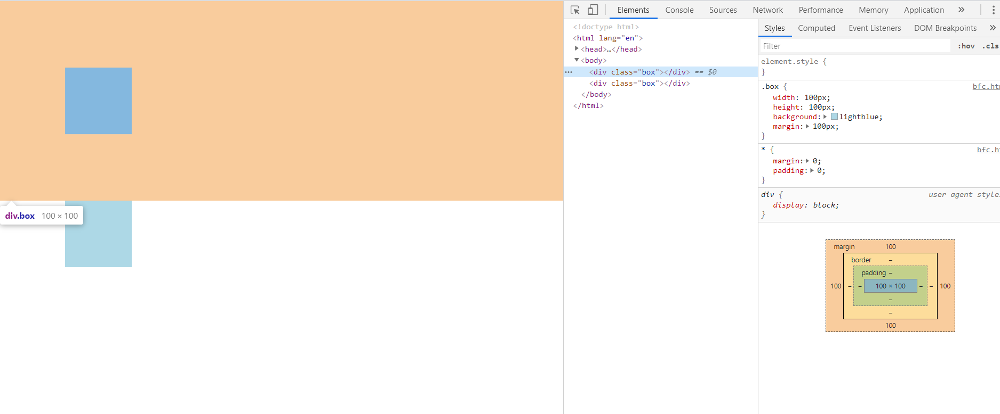
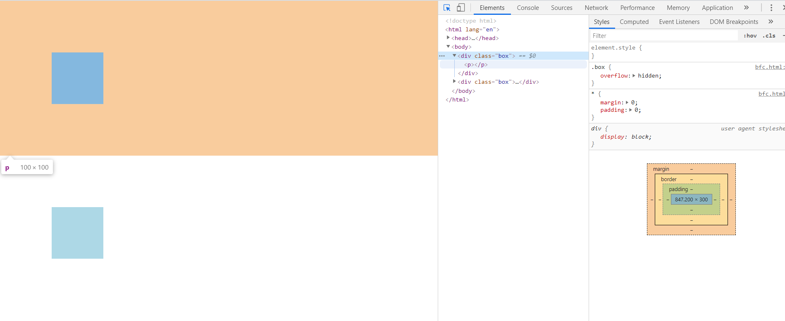
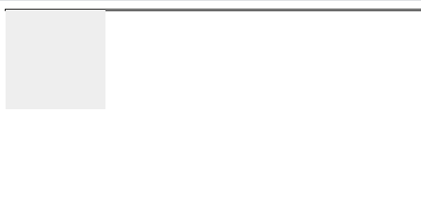
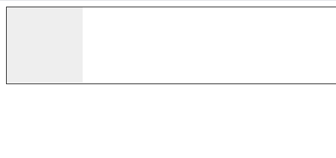
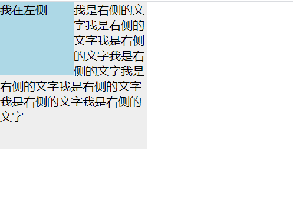
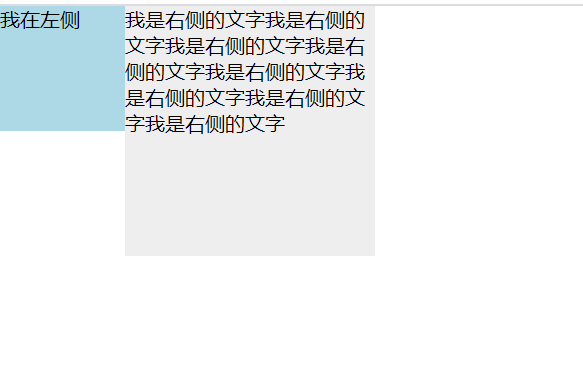

### 一、BFC定义

BFC 全称 Block Formatting Context，即块级格式化上下文。它是一个独立的渲染区域，在这个区域中，只有block box 参与布局，并且与这个区域外部毫不相干。

关于box的概念:

Box是CSS布局的对象和基本单位，换句话说，我们看到的页面是由很多个box组成的。元素的类型和display属性，决定了这个box的类型。不同类型的 Box， 会参与不同的 Formatting Context（一个决定如何渲染文档的容器），因此Box内的元素会以不同的方式渲染。

block-level box: 指 display属性为 block、list-item、table 的元素;
inline-level box: 指 display 属性为inline,inline,inline-table 的元素;
run in box: CSS3规范中新加的属性;

### 二、如何形成BFC

- 根元素或其他包含它的元素
- 浮动元素（元素的float不是none）
- 绝对定位元素（元素具有 position为absolute或fixed）
- 内联块（元素具有 display : inline-block）
- 具有overflow且值不是 visible 的块元素
- 表格单元格（元素具有 display: table-cell,html表格单元格默认属性）
- 表格标题（元素具有 display:table-caption, html表格标题默认属性）
- display:flow-root 的元素，这是唯一没有副作用的一种
- column-span: all 的元素

### 三、BFC的布局规则

- 内部的box将会独占宽度，且在垂直方向，一个接一个排列
- Box垂直方向的距离由margin决定，属于同一个BFC的两个相邻Box的margin会发生重叠
- 每个盒子（块盒与行盒）的margin box的左边，与包含块border box的左边相接触(对于从左往右的格式化，否则相反)，即使存在浮动也是如此
- BFC 区域不会与浮动元素重叠，而是会依次排列
- BFC区域内是一个独立的渲染容器，容器内元素和BFC区域外元素不会形成任何干扰
- 计算BFC的高度时，浮动元素也参与计算

### 四、BFC的应用

1. 利用BFC避免margin重叠

```
<body>
    <div class="box"></div>
    <div class="box"></div>
</body>

    <style>
        * {
            margin: 0;
            padding: 0;
        }

        .box {
            width: 100px;
            height: 100px;
            background: lightblue;
            margin: 100px;
        }
    </style>
```



从效果上看，因为两个 div 元素都处于同一个 BFC 容器下 (这里指 body 元素) 所以第一个 div 的下边距和第二个 div 的上边距发生了重叠，所以两个盒子之间距离只有 100px，而不是 200px。

**如果想要避免外边距的重叠，可以将其放在不同的 BFC 容器中**

```
<body>
    <div class="box">
        <p></p>
    </div>
    <div class="box">
        <p></p>
    </div>
</body>

    <style>
        * {
            margin: 0;
            padding: 0;
        }

        .box {
            overflow: hidden;
        }

        p {
            width: 100px;
            height: 100px;
            background: lightblue;
            margin: 100px;
        }
    </style>
```



2. 使用 BFC 包含浮动的元素(清除浮动)

```
<body>
    <div style="border: 1px solid #000;">
        <div style="width: 100px;height: 100px;background: #eee;float: left;"></div>
    </div>
</body>
```



由于容器内元素浮动，脱离了文档流，所以容器只剩下 2px 的边距高度。如果使触发容器的 BFC，那么容器将会包裹着浮动元素。

```
<body>
    <div style="border: 1px solid #000;overflow: hidden">
        <div style="width: 100px;height: 100px;background: #eee;float: left;"></div>
    </div>
</body>
```



3.  BFC 可以阻止元素被浮动元素覆盖(使用BFC避免文字环绕)

```
<body>
    <div class="left">我在左侧</div>
    <div class="right">
        我是右侧的文字我是右侧的文字我是右侧的文字我是右侧的文字我是右侧的文字我是右侧的文字我是右侧的文字我是右侧的文字
    </div>
</body>

    <style>
        * {
            margin: 0;
            padding: 0;
        }

        .left {
            width: 100px;
            height: 100px;
            background: lightblue;
            float: left;
        }

        .right {
            width: 200px;
            height: 200px;
            background: #eee;
        }
    </style>
```



第二个元素有部分被浮动元素所覆盖，(但是文本信息不会被浮动元素所覆盖) 如果想避免元素被覆盖，可以利用第二个元素的 BFC 特性。



4. 自适应两栏布局

```
<body>
    <div class="left">我在左侧</div>
    <div class="right">我是右侧的文字我是右侧的文字我是右侧的文字我是右侧的文字我是右侧的文字我是右侧的文字我是右侧的文字我是右侧的文字</div>
</body>

    <style>
        * {
            margin: 0;
            padding: 0;
        }

        .left {
            width: 100px;
            height: 150px;
            float: left;
            background: lightblue;
        }

        .right {
            overflow: hidden;
            height: 300px;
            background: #eee;
        }
    </style>
```


原理:

- 每个盒子（块盒与行盒）的margin box的左边，与包含块border box的左边相接触(对于从左往右的格式化，否则相反)，即使存在浮动也是如此
- BFC 区域不会与浮动元素(float box)重叠，而是会依次排列
