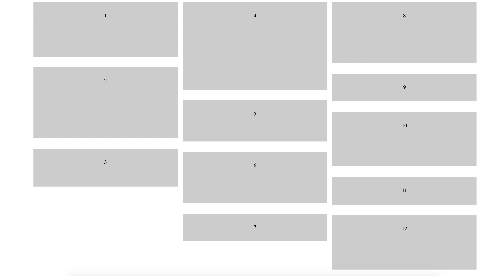

## 概括

瀑布流又称瀑布流式布局(Masonry Layouts)，它与传统对分页显示的区别是：视觉上表现为参差不齐的多栏布局(网页上呈现参差不齐的多栏布局，图片等宽不等高，根据图片原比例缩放直至宽度达到固定的要求，每行排满后，后面的元素依次添加到其后，视觉上显得错落有致不拘一格。)。

### 优点

- 节省空间，外表美观，更有艺术性。
- 对于触屏设备非常友好，通过向上滑动浏览
- 用户浏览时的观赏和思维不容易被打断，留存更容易

### 缺点

- 用户无法了解内容总长度，对内容没有宏观掌控。
- 用户无法了解现在所处的具体位置，不知道离终点还有多远。
- 回溯时不容易定位到之前看到的内容。
- 容易造成页面加载的负荷。
- 容易造成用户浏览的疲劳，没有短暂的休息时间。

### 瀑布流的代码实现

#### CSS多列布局实现

这里借助column-columns 属性，可以设置将div元素中的文本分成几列，还会用到另一个属性 column-gap，用来调整边距，实现瀑布流布局

```
<!DOCTYPE html>
<html lang="en">
  <head>
    <meta charset="UTF-8" />
    <meta name="viewport" content="width=device-width, initial-scale=1.0" />
    <meta http-equiv="X-UA-Compatible" content="ie=edge" />
    <title>Document</title>
    <style>
      .demo-1 {
        -moz-column-count: 3; /* Firefox */
        -webkit-column-count: 3; /* Safari 和 Chrome */
        column-count: 3;
        -moz-column-gap: 1em;
        -webkit-column-gap: 1em;
        column-gap: 1em;
        width: 80%;
        margin: 0 auto;
      }
      .item {
        padding: 2em;
        margin-bottom: 2em;
        -webkit-column-break-inside: avoid;
        break-inside: avoid; /*防止断点*/
        background: #ccc;
        text-align: center;
      }
    </style>
  </head>
  <body>
    <div class="demo-1">
      <div class="item">
        <div class="item_content content-lar" style="height:100px;">1</div>
      </div>
      <div class="item">
        <div class="item_content content-sma" style="height:150px;">2</div>
      </div>
      <div class="item">
        <div class="item_content content-mid" style="height:50px;">3</div>
      </div>
      <div class="item">
        <div class="item_content content-sma" style="height:200px;">4</div>
      </div>
      <div class="item">
        <div class="item_content content-mid" style="height:60px;">5</div>
      </div>
      <div class="item">
        <div class="item_content content-lar" style="height:90px;">6</div>
      </div>
      <div class="item">
        <div class="item_content content-sma">7</div>
      </div>
      <div class="item">
        <div class="item_content content-lar" style="height:120px;">8</div>
      </div>
      <div class="item">
        <div class="item_content content-lar">9</div>
      </div>
      <div class="item">
        <div class="item_content content-sma" style="height:100px;">10</div>
      </div>
      <div class="item">
        <div class="item_content content-mid">11</div>
      </div>
      <div class="item">
        <div class="item_content content-mid" style="height:100px;">12</div>
      </div>
      <!-- more items -->
    </div>
  </body>
</html>
```



如果使用纯css写瀑布流，则每一块都是从上往下排列，不能做到从左到右排列，并且不会识别哪一块图片放在哪个地方合适，若是再配合动态加载，效果会特别不好，所以只能通过JS来实现瀑布流。

#### JS实现

思路：每次加载图片时，会需要判断哪一列的图片累计的高度最小，那么下一张图片就放在哪一列，即瀑布流算法去判断图片的确定位置

1. 设定每一列图片的宽度和间距
2. 获取当前窗口的总宽度，从而根据图片宽度去旁段分成几列
3. 获取所有图片元素，定义一个空数组来保存高度
4. 遍历所有容器，开始判断　　当页面加载完成，或页面宽度发生变化时，调用函数。

    - 如果当前处于第一行时： 直接设置图片位置【 即 top为间距的大小，left为（当前图片的宽度+间距） * 当前图片的值+间距大小 】，并保存当前元素高度。
    - 如果当前不处于第一行时：进行高度对比，通过遍历循环，拿到最小高度和相对应的索引，设置图片位置【 即 top为最小高度值+间距*2，left为（当前图片的宽度+间距）* 索引 值+间距大小）】，并修改当前索引的高度为当前元素高度。

5. 当页面加载完成，或页面宽度发生变化时，调用函数。

```
<!DOCTYPE html>
<html lang="en">
  <head>
    <meta charset="UTF-8" />
    <meta name="viewport" content="width=device-width, initial-scale=1.0" />
    <meta http-equiv="X-UA-Compatible" content="ie=edge" />
    <title>Document</title>
    <style>
      .water-basic {
        position: relative;
      }
      .item {
        position: absolute;
        width: 200px;
        margin: 5px;
        transition: all 1s;
        font-size: 36px;
      }
      .box1 {
        height: 500px;
        background-color: red;
      }
      .box2 {
        height: 300px;
        background-color: blue;
      }
      .box3 {
        height: 200px;
        background-color: gray;
      }
      .box4 {
        height: 700px;
        background-color: pink;
      }
      .box5 {
        height: 600px;
        background-color: yellow;
      }
    </style>
  </head>
  <body>
    <div class="water-basic">
      <div class="item box1">1</div>
      <div class="item box2">2</div>
      <div class="item box1">3</div>
      <div class="item box4">4</div>
      <div class="item box5">5</div>
      <div class="item box3">6</div>
      <div class="item box2">7</div>
      <div class="item box1">8</div>
      <div class="item box1">9</div>
      <div class="item box2">10</div>
      <div class="item box4">11</div>
      <div class="item box3">12</div>
      <div class="item box1">13</div>
      <div class="item box5">14</div>
      <div class="item box2">15</div>
      <div class="item box1">16</div>
      <div class="item box3">17</div>
      <div class="item box1">18</div>
      <div class="item box2">19</div>
      <div class="item box1">20</div>
      <div class="item box4">21</div>
      <div class="item box5">22</div>
      <div class="item box3">23</div>
      <div class="item box2">24</div>
      <div class="item box1">25</div>
      <div class="item box1">26</div>
      <div class="item box2">27</div>
      <div class="item box4">28</div>
      <div class="item box3">29</div>
      <div class="item box1">30</div>
      <div class="item box5">31</div>
      <div class="item box2">32</div>
      <div class="item box1">33</div>
      <div class="item box3">34</div>
    </div>

    <script type="text/javascript">
      // 定义瀑布流算法函数
      function fall() {
        const minGap = 10; // 最小间距，让每一列的最小空隙可以自定义，避免太过拥挤的情况发生。但是，会通过计算得到真实的间距。
        const itemWidth = 300; // 每一项的宽度，即当前每一个图片容器的宽度。保证每一列都是等宽不等高的。
        const scrollBarWidth = getScrollbarWidth(); // 获取滚动条的宽度
        const pageWidth = window.innerWidth - scrollBarWidth; // 获取当前页面的宽度 = window.innerWidth - 滚动条的宽度
        const column = Math.floor(pageWidth / (itemWidth + minGap)); // 实际列数=页面宽度/(图片宽度+最小间距)
        const gap = (pageWidth - itemWidth * column) / column / 2; // 计算真实间距 = (页面宽度- 图片宽度*实际列数)/实际列数/2
        const items = document.querySelectorAll(".item"); // 获取所有的外层元素
        const heightArr = []; // 定义一个空数组，保存最低高度。

        // 获取滚动条的宽度
        function getScrollbarWidth() {
          const oDiv = document.createElement("div"); //创建一个div
          // 给div设置样式。随便定义宽高，只要能获取到滚动条就可以
          oDiv.style.cssText = `width: 50px;height: 50px;overflow: scroll;`;
          document.body.appendChild(oDiv); //把div添加到body中
          const scrollbarWidth = oDiv.offsetWidth - oDiv.clientWidth; // 使最大宽度和可视宽度相减，获得到滚动条宽度。
          oDiv.remove(); //移除创建的div
          return scrollbarWidth; //返回滚动条宽度
        }

        for (let i = 0; i < items.length; i++) {
          // 遍历所有的外层容器
          const height = items[i].offsetHeight;
          // 如果当前处在第一行
          if (i < column) {
            // 直接设置元素距离上部的位置和距离左边的距离。
            items[i].style.cssText = `top: ${gap}px;left: ${(itemWidth + gap) *
              i +
              gap}px`;
            // 保存当前元素的高度。
            heightArr.push(height);
          } else {
            // 不是第一行的话，就进行比对。
            let minHeight = heightArr[0]; // 先保存第一项的高度
            let minIndex = 0; // 保存第一项的索引值
            for (let j = 0; j < heightArr.length; j++) {
              // 通过循环遍历比对，拿到最小值和最小值的索引。
              if (minHeight > heightArr[j]) {
                minHeight = heightArr[j];
                minIndex = j;
              }
            }
            // 通过最小值为当前元素设置top值，通过索引为当前元素设置left值。
            items[i].style.cssText = `top: ${minHeight +
              gap * 2}px; left: ${(itemWidth + gap) * minIndex + gap}px`;
            // 并修改当前索引的高度为当前元素的高度
            heightArr[minIndex] = minHeight + gap + height;
          }
        }
      }
      // 页面加载完成调用一次。
      window.onload = fall;
      // 页面尺寸发生改变再次调用。
      window.onresize = fall;
    </script>
  </body>
</html>
```

### Vue实现瀑布流布局的组件

- vue-waterfall
- vue-waterfall-easy
- vue-virtual-collection
- vue-grid-layout
