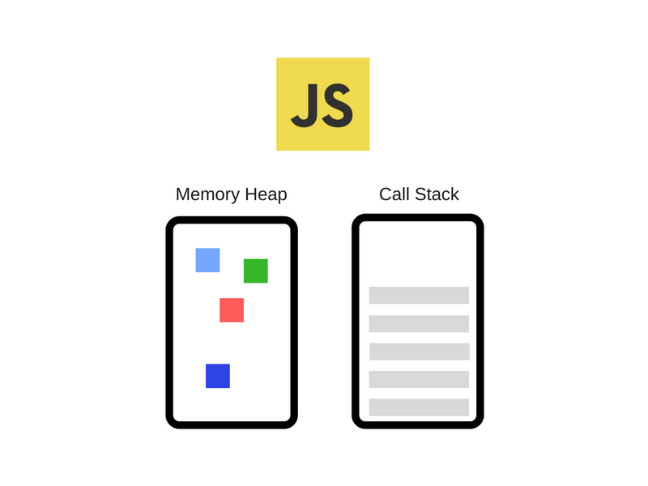
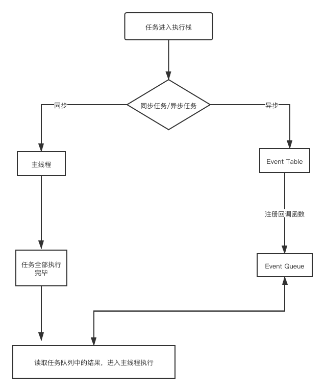
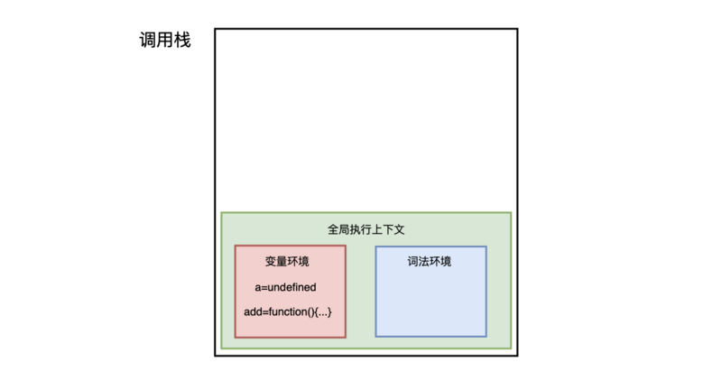
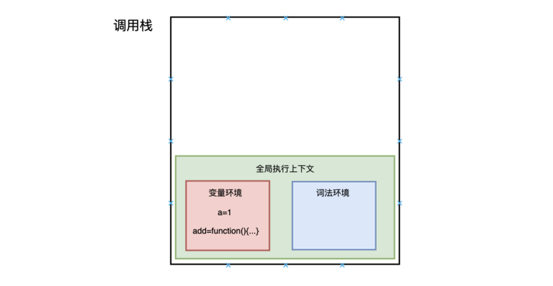
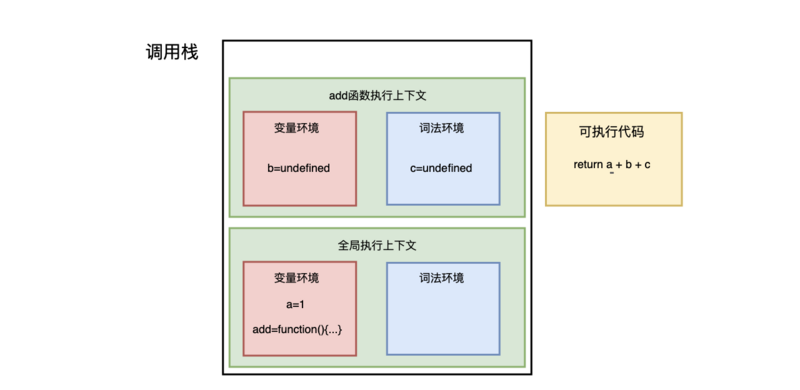
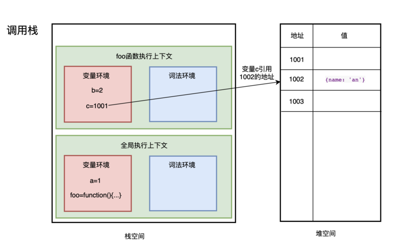

本文整理了 JavaScrip 如何运行的相关概念，通过了解这些细节，希望能够适当地利用所提供的 API 来编写更好的、非阻塞的应用程序。

### 一、栈

栈是一个线性结构，用作表示元素的集合。可将它类比于一组物体的堆叠(一摞书,一摞盘子之类的)，最大的特点是只能在某一端添加或删除数据，遵循**先进后出**的原则。此外，应有一个 peek 操作用于访问栈当前顶端(末尾)的元素。

栈的基本操作包括创建栈、销毁栈、出栈、入栈、获取栈顶元素、获取栈的大小、清空栈等。

### 二、执行上下文

执行上下文是当前 JavaScript 代码被解析和执行时所在环境的抽象概念。

执行上下文共有三种类型：

- 全局执行上下文：只有一个，不在任何函数中的代码都位于全局执行上下文中，共有两个过程：1.创建全局对象，浏览器中的全局对象即window对象；2.this指向这个全局对象
- 函数执行上下文：可存在多个，这些函数执行上下文按照特定的顺序执行一系列步骤。只有在函数被调用的时候才会被创建，每次调用函数都会为该函数创建一个新的执行上下文
- Eval 函数执行上下文：运行在 eval 函数中的代码也有自己的执行上下文，很少用而且不建议使用

### 三、JavaScript引擎

JavaScript引擎的一个流行示例是Google的V8引擎。例如，在Chrome和Node.js中使用V8引擎，下面是一个非常简化的视图：



V8引擎由两个主要部件构成：
- emory Heap(内存堆)：内存分配地址的地方
- Call Stack(调用栈)：代码执行的地方

有些浏览器的API经常被使用到（比如：setTimeout），但是这些API并不是引擎提供的。我们把浏览器提供的API称为Web API，比如DOM，Ajax，setTimeout等。

V8引擎的垃圾回收机制：
```
v8 的垃圾回收机制基于分代回收机制，这个机制又基于世代假说，这个假说有两个特点，一是新生的对象容易早死，另一个是不死的对象会活得更久。基于这个假说，v8 引擎将内存分为了新生代和老生代。

新创建的对象或者只经历过一次的垃圾回收的对象被称为新生代。经历过多次垃圾回收的对象被称为老生代。

新生代被分为 From 和 To 两个空间，To 一般是闲置的。当 From 空间满了的时候会执行 Scavenge 算法进行垃圾回收。当我们执行垃圾回收算法的时候应用逻辑将会停止，等垃圾回收结束后再继续执行。这个算法分为三步：

（1）首先检查 From 空间的存活对象，如果对象存活则判断对象是否满足晋升到老生代的条件，如果满足条件则晋升到老生代。如果不满足条件则移动 To 空间。

（2）如果对象不存活，则释放对象的空间。

（3）最后将 From 空间和 To 空间角色进行交换。

新生代对象晋升到老生代有两个条件：

（1）第一个是判断是对象否已经经过一次 Scavenge 回收。若经历过，则将对象从 From 空间复制到老生代中；若没有经历，则复制到 To 空间。

（2）第二个是 To 空间的内存使用占比是否超过限制。当对象从 From 空间复制到 To 空间时，若 To 空间使用超过 25%，则对象直接晋升到老生代中。设置 25% 的原因主要是因为算法结束后，两个空间结束后会交换位置，如果 To 空间的内存太小，会影响后续的内存分配。

老生代采用了标记清除法和标记压缩法。标记清除法首先会对内存中存活的对象进行标记，标记结束后清除掉那些没有标记的对象。由于标记清除后会造成很多的内存碎片，不便于后面的内存分配。所以了解决内存碎片的问题引入了标记压缩法。

由于在进行垃圾回收的时候会暂停应用的逻辑，对于新生代方法由于内存小，每次停顿的时间不会太长，但对于老生代来说每次垃圾回收的时间长，停顿会造成很大的影响。 为了解决这个问题 V8 引入了增量标记的方法，将一次停顿进行的过程分为了多步，每次执行完一小步就让运行逻辑执行一会，就这样交替运行。

```

### 四、浏览器中JS的运行机制

#### 4.1 js单线程

JavaScript的单线程，与它的用途有关。作为浏览器脚本语言，JavaScript的主要用途是与用户互动，以及操作DOM。这决定了它只能是单线程，试想两个进程同时操作某个DOM的结果？

#### 4.2 事件循环

js代码执行过程中会有很多任务，这些任务总的分成两类：

- 同步任务
- 异步任务

当我们进入网站时，网页的渲染过程就是一大堆同步任务，比如页面骨架和页面元素的渲染。而像加载图片音乐之类占用资源大耗时久的任务，就是异步任务。



1. js 是单线程运行的，在代码执行的时候，通过将不同函数的执行上下文压入执行栈中来保证代码的有序执行。
2. 在执行同步代码的时候，如果遇到了异步事件，js 引擎并不会一直等待其返回结果，而是会将这个事件挂起，继续执行执行栈中的其他任务。
3. 当同步事件执行完毕后，再将异步事件对应的回调加入到与当前执行栈中不同的另一个任务队列中等待执行。
4. 任务队列可以分为宏任务对列和微任务对列，当当前执行栈中的事件执行完毕后，js 引擎首先会判断微任务对列中是否有任务可以执行，如果有就将微任务队首的事件压入栈中执行。
5. 当微任务对列中的任务都执行完成后再去判断宏任务对列中的任务。

同步任务都在主线程（这里的主线程就是 JavaScript 引擎线程）上执行，会形成一个 **调用栈** ，又称 执行栈 ；

除了主线程外，还有一个任务队列（也称消息队列），用于管理异步任务的 **事件回调** ，在 **调用栈** 的任务执行完毕之后，系统会检查任务队列，看是否有可以执行的异步任务。

**主线程执行栈何时执行完毕**: js引擎存在monitoring process进程，会持续不断的检查主线程执行栈是否为空，一旦为空，就会去Event Queue那里检查是否有等待被调用的函数。

除了同步任务和异步任务，任务还可以更加细分为macrotask(宏任务)和microtask(微任务)，js引擎会优先执行微任务

```
微任务包括了 promise 的回调、node 中的 process.nextTick 、对 Dom 变化监听的 MutationObserver。

宏任务包括了 script 脚本的执行、setTimeout ，setInterval ，setImmediate 一类的定时事件，还有如 I/O 操作、UI 渲
染等。
```

我们的重点是研究调用栈机制。

### 五、调用栈

Javascript是一种单线程语言，这意味着它只有一个调用堆栈，一次只能做一件事。

调用栈是 JavaScript 用来管理函数执行上下文的一种数据结构，它记录了当前函数执行的位置，哪个函数正在被执行。 如果我们执行一个函数，就会为函数创建执行上下文并放入栈顶。 如果我们从函数返回，就将它的执行上下文从栈顶弹出。 也可以说调用栈是用来管理这种执行上下文的栈，或称执行上下文栈（执行栈）。

让我们通过下面的代码示例来理解这一点：
```
var a = 1
function add(a) {
  var b = 2
  let c = 3
  return a + b + c
}

// 函数调用
add(a)
```

下面我们就一步步的介绍整个函数调用执行的过程。

在执行这段代码之前，JavaScript引擎会先创建一个全局执行上下文，包含所有已声明的函数与变量：


从图中可以看出，代码中的全局变量a及函数add保存在变量环境中。

执行上下文准备好后，开始执行全局代码，首先执行a=1的赋值操作


赋值完成后 a 的值由 undefined 变为 1，然后执行 add 函数，JavaScript 判断出这是一个函数调用，然后执行以下操作：

- 首先，从全局执行上下文中，取出 add 函数代码
- 其次，对 add 函数的这段代码进行编译，并创建该函数的执行上下文和可执行代码，并将执行上下文压入栈中


- 然后，执行代码，返回结果，并将add的执行上下文从栈顶弹出，此时调用栈中就只剩下全局上下文。


至此，整个函数调用执行就结束了。

**栈溢出**：调用栈是用来管理执行上下文的一种数据结构，它是有大小的，当入栈的上下文过多的时候，它就会报栈溢出的错误。

**在浏览器中获取调用栈信息**

两种方式，一种是断点调试，这种很简单，我们日常开发中都用过。

一种是 console.trace()

```
function sum(){
  return add()
}
function add() {
  console.trace()
  return 1
}

// 函数调用
sum()
```

### 六、JS内存机制

JavaScript 中的内存空间主要分为三种类型：

- 代码空间：主要用来存放可执行代码
- 栈空间：调用栈的存储空间就是栈空间
- 堆空间

代码空间主要用来存放可执行代码的。栈空间及堆空间主要用来存放数据的。

JavaScript一共有8种数据类型，其中有7种基本数据类型：Undefined、Null、Boolean、Number、String、Symbol（es6新增，表示独一无二的值）和BigInt（es10新增）；
1种引用数据类型 —— Object（Object本质上是由一组无序的名值对组成的）。里面包含 function、Array、Date等。JavaScript不支持任何创建自定义类型的机制，而所有值最终都将是上述 8 种数据类型之一。

*关于数据类型：*
```
原始数据类型：直接存储在栈（stack）中，占据空间小、大小固定，属于被频繁使用数据，所以放入栈中存储。

引用数据类型：同时存储在栈（stack）和堆（heap）中，占据空间大、大小不固定。引用数据类型在栈中存储了指针，该指针指向堆中该实体的起始地址。当解释器寻找引用值时，会首先检索其在栈中的地址，取得地址后从堆中获得实体。
```

#### 6.1 栈空间

基本类型在内存中占有固定大小的空间，他们直接保存在栈空间，我们通过 按值访问。一般栈空间不会很大。

#### 6.2 堆空间

引用类型，值大小不固定，但指向值的指针大小（内存地址）是固定的，所以把对象放入堆中，将对象的地址放入栈中，这样，在调用栈中切换上下文时，只需要将指针下移到上个执行上下文的地址就可以了，同时保证了栈空间不会很大。

当查询引用类型的变量时， 先从栈中读取内存地址， 然后再通过地址找到堆中的值。对于这种，我们把它叫做 按引用访问 。

一般堆内存空间很大，能存放很多数据，但它内存分配与回收都需要花费一定的时间。

例如：
```dotnetcli
var a = 1
function foo() {
  var b = 2
  var c = { name: 'an' }
}

// 函数调用
foo()
```


基本类型(栈空间)与引用类型(堆空间)的存储方式决定了：基本类型赋值是值赋值，引用类型赋值是地址赋值。

```
// 值赋值
var a = 1
var b = a
a = 2
console.log(b) 
// 1
// b 不变

// 地址赋值
var a1 = {name: 'an'}
var b1 = a1
a1.name = 'bottle'
console.log(b1)
// {name: "bottle"}
// b1 值改变
```

#### 6.3 垃圾回收

JavaScript中的垃圾数据都是由垃圾回收器自动回收的，不需要手动释放。

**回收栈空间**

在JavaScript执行代码时，主线程上会存在ESP指针，用来指向调用栈中当前正在执行的上下文。

### 参考

- https://segmentfault.com/a/1190000017352941
- https://juejin.im/post/5bdfd3e151882516c6432c32
- https://segmentfault.com/a/1190000022821648
