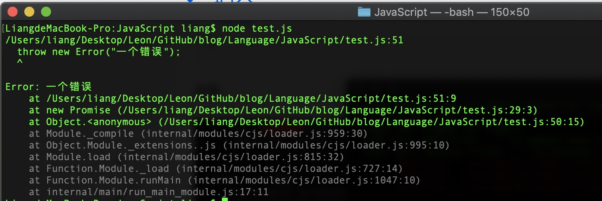
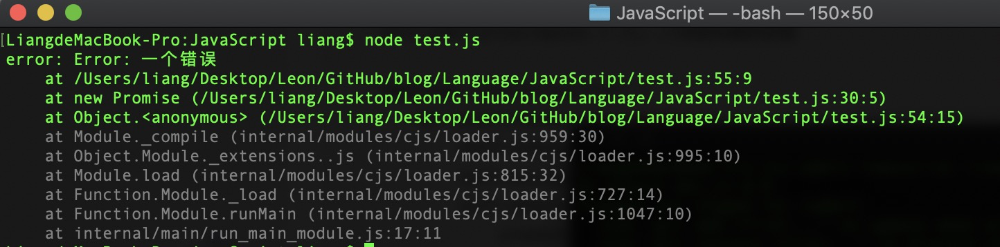

## 关于Promise

[Promise MDN](https://developer.mozilla.org/zh-CN/docs/Web/JavaScript/Reference/Global_Objects/Promise)

Promise 对象用于表示一个异步操作的最终完成 (或失败)及其结果值。它其实就是一个容器，里面保存着未来才会结束的事件（通常是一个异步操作）的结果。

一个 Promise 对象代表一个在这个 promise 被创建出来时不一定已知的值。它让您能够把异步操作最终的成功返回值或者失败原因和相应的处理程序关联起来。 这样使得异步方法可以像同步方法那样返回值：异步方法并不会立即返回最终的值，而是会返回一个 promise，以便在未来某个时候把值交给使用者。

- 对象的状态不受外界影响
- 一旦状态改变，就不会再改变，任何时候都可以得到这个结果。


## 基本用法

在 ES6 中，Promise对象是一个构造函数，用来生成Promise实例。

```
const promise = new Promise((resolve,reject) => {
    // 此处执行一些异步操作（调用后台API，定时器等）
    if (/*异步操作成功*/) {
        resolve(value);
    } else {
        reject(error)
    }
})
// 其中两个函数的参数值分别为成功和失败后想要传递的结果
```

Promise构造函数接受一个函数作为参数，该函数的两个参数分别是resolve和reject。它们是两个函数，由 JavaScript 引擎提供，不用自己部署。

resolve函数的作用是，将Promise对象的状态从"未完成"变为"成功"（即从 pending 变为 resolved），在异步操作成功时调用，并将异步操作的结果，作为参数传递出去；reject函数的作用是，将Promise对象的状态从"未完成"变为"失败"（即从 pending变为 rejected），在异步操作失败时调用，并将异步操作报出的错误，作为参数传递出去。

then方法可以接受两个回调函数作为参数。第一个回调函数是Promise对象的状态变为resolved时调用，第二个回调函数是Promise对象的状态变为rejected时调用。其中，第二个函数是可选的，不一定要提供。这两个函数都接受Promise对象传出的值作为参数。

```
promise.then(res => {
    // 对于成功回调接受的数据做处理
}, err => {
    // 对于失败的回调数据做处理
})
```
*Promise新建后就会立即执行*

Promise.prototype.then()
Promise实例具有then方法，也就是说，then方法是定义在原型对象上Promise.prototype上的，它的作用是为 Promise实例添加状态改变时的回调函数。前面说过，then方法的第一个参数是resolved状态的回调函数，第二个参数（可选）是rejected状态的回调函数。

因为 Promise.prototype.then 和  Promise.prototype.catch 方法返回的是 promise(不是原来那个Promise实例)， 所以它们可以被链式调用。

采用链式的 then，可以指定一组按照次序调用的回调函数。（ES7中的async/await）也可以实现链式调用，除此之外，Promise的all方法可以实现并行执行。

## 手写Promise

首先写 Promise构造函数，由以上Promise的使用可知，其参数为一个函数，又被称为执行器函数（executor），并且执行器函数会被立即调用，执行器函数也会接收两个参数，且这两个参数均为函数。

```
function Promise(executor) {
    executor(resolve, reject);
}
```

Promise最重要的方法就是then方法，因此为了能够让实例调用这个方法，我们必须将这个方法写在其原型链上，并且它接受两个参数，一个为成功的回调，一个为失败得回调。

```
Promise.prototype.then = function(onResolved,onRejected) {
    // 此处执行一些异步操作，根据结果决定下一步
}
```

之后继续写Promise函数，因为new出来的实例具有默认的状态pending，之后通过执行器executor执行 resolve和reject两个函数来修改状态。
```
function Promise(executor) {
  let self = this; //保留this。防止后面方法出现this只想不明的问题
  self.status = "pending"; //promise的默认状态是pending

  function resolve() {
    self.status = "resolved"; //成功函数将其状态修改为resolved
  }
  function reject() {
    self.status = "rejected"; //失败函数将其函数修改为rejected
  }
  executor(resolve, reject);
}
```

为了保证 Promise实例状态一旦变更不能再次改变，需要进行判断
```
function Promise(executor) {
  let self = this; //保留this。防止后面方法出现this只想不明的问题
  self.status = "pending"; //promise的默认状态是pending
  self.success = undefined; //保存成功回调传递的值
  self.error = undefined; //保存失败回调传递的值

  function resolve() {
    if (self.status === "pending") {
      self.status = "resolved"; //成功函数将其状态修改为resolved
    }
  }
  function reject() {
    if (self.status === "pending") {
      self.status = "rejected"; //失败函数将其函数修改为rejected
    }
  }
  executor(resolve, reject);
}
```

之后需要将调用之后的成功或失败的结果保存起来
```
function Promise(executor) {
  let self = this; //保留this。防止后面方法出现this只想不明的问题
  self.status = "pending"; //promise的默认状态是pending
  self.success = undefined; //保存成功回调传递的值
  self.error = undefined; //保存失败回调传递的值

  function resolve(success) {
    if (self.status === "pending") {
      self.status = "resolved"; //成功函数将其状态修改为resolved
      self.success = success; //将成功的值保存起来
    }
  }
  function reject(error) {
    if (self.status === "pending") {
      self.status = "rejected"; //失败函数将其函数修改为rejected
      self.error = error; //将失败的值保存起来
    }
  }
  executor(resolve, reject);
}
```

当执行器调用 resolve函数后，then中的第一个参数函数（成功回调）会执行，并将保存的值传递给then中的第一个函数作为参数，同时当执行器调用 reject函数后，then中的第二个参数函数（失败回调）会执行，并将保存的值传递给then中的第二个函数作为参数。

```
Promise.prototype.then = function(onResolved, onRejected) {
  let self = this;
  if (self.status === "resolved");
  {
    onResolved(self.success); //将resolve函数保留的成功值传递作为参数
  }
  if (self.status === "rejected") {
    onRejected(self.error); //将reject函数保留的失败值传递作为参数
  }
};
```

到此为止Promise的简单结构已经基本完成，简单测试
```
let promise = new Promise((resolve, reject) => {
  console.log("start");
  resolve("success data");
});

promise.then(
  res => {
    console.log("res", res);
  },
  err => {
    console.log("err", err);
  }
);
```
测试结果
```
start
res success data
```

以上步骤只是实现了同步处理，接下来实现异步处理以及实现一个实例多次调用then方法（不是链式调用）

因为 js是单线程的，简单理解浏览器端的事件循环即为先执行同步任务，后执行异步任务。同步任务是存放在调用栈中的，主线程会先执行同步任务，当调用栈中的同步任务全都执行完毕且主线程为空时，主线程会去任务队列中查找是否有已经注册的异步任务的回调函数，有则执行，无则等待。任务队列中的异步任务又分为微任务和宏任务，这两者也有相应的执行顺序。

### 异步处理及多次调用

如果Promise处理的为一个异步函数，那么当then的时候，执行器函数中的参数会被放到异步任务队列中，即为此时Promise的实例仍为默认状态pending，没有改变，那么我们此时并不知道要去执行then中的成功回调函数还是失败回调函数，在不知道哪个回调函数会被执行的情况下，就需要把这两个回调函数保存起来，等到时机成熟，确定哪个函数的时候，再拿出来调用。

```
function Promise(executor) {
  let self = this; //保留this。防止后面方法出现this只想不明的问题
  self.status = "pending"; //promise的默认状态是pending
  self.success = undefined; //保存成功回调传递的值
  self.error = undefined; //保存失败回调传递的值

  self.onSuccessCallbacks = []; //存放成功的回调
  self.onErrorCallbacks = []; //存放失败的回调

  function resolve(success) {
    if (self.status === "pending") {
      self.status = "resolved"; //成功函数将其状态修改为resolved
      self.success = success; //将成功的值保存起来
      self.onSuccessCallbacks.forEach(element => {
        element();
      });
    }
  }

  function reject(error) {
    if (self.status === "pending") {
      self.status = "rejected"; //失败函数将其函数修改为rejected
      self.error = error; //将失败的值保存起来
      self.onErrorCallbacks.forEach(element => {
        element();
      });
    }
  }
  executor(resolve, reject);
}

Promise.prototype.then = function(onResolved, onRejected) {
  let self = this;
  if (self.status === "pending") {
    self.onSuccessCallbacks.push(() => {
      onResolved(self.success); //将resolve函数保留的成功值传递作为参数
    });
    self.onErrorCallbacks.push(() => {
      onRejected(self.error); //将reject函数保留的失败值传递作为参数
    });
  }
  if (self.status === "resolved") {
    onResolved(self.success); //将resolve函数保留的成功值传递作为参数
  }
  if (self.status === "rejected") {
    onRejected(self.error); //将reject函数保留的失败值传递作为参数
  }
};
```

测试用例：
```
let promise = new Promise((resolve, reject) => {
    setTimeout(function () {
        resolve('success data')
    }, 2000)
})

promise.then(res => {
    console.log("success:", res);
}, err => {
    console.log("error:", err);
})
promise.then(res => {
    console.log("success:", res);
}, err => {
    console.log("error:", err);
})
```

测试结果为2秒后出现结果
```
success: success data
success: success data
```

继续进行尝试，如果让Promise抛出一个错误如何处理
```
let promise = new Promise((resolve, reject) => {
    throw new error("一个错误");
})

promise.then(res => {
    console.log("success:", res);
}, err => {
    console.log("error:", err);
})
```

结果：


解决该问题
```
try {
    executor(resolve, reject);
} catch (err) {
    reject(err);
}
```

再次尝试，查看结果


修改结果则为直接对executor函数进行异常处理，如果出错了就直接进入reject方法。

### 链式调用

Promise实现链式调用就是通过then方法返回一个新的Promise。

如果返回的是一个Promise函数，那么会等待这个Promise执行完成之后再返回给下一次的then，Promise如果成功，就会走下一次then的成功，如果失败就会走下一次then的失败。

注意：then方法中返回的回调函数不能是自己本身，如果真的这样写，那么函数执行到里面时会等待promise的结果，这样一层层的状态等待就会形成回调地狱。
接下来一步步分析（只需要改进then函数即可）

then函数中嵌套new Promise


到此基本功能已经完成，以下为源码以及测试例子及结果

源码：
```
//Promise函数
function Promise(executor) {
  let self = this; //保留this。防止后面方法出现this只想不明的问题
  self.status = "pending"; //promise的默认状态是pending
  self.success = undefined; //保存成功回调传递的值
  self.error = undefined; //保存失败回调传递的值

  self.onSuccessCallbacks = []; //存放成功的回调
  self.onErrorCallbacks = []; //存放失败的回调

  function resolve(success) {
    if (self.status === "pending") {
      self.status = "resolved"; //成功函数将其状态修改为resolved
      self.success = success; //将成功的值保存起来
      self.onSuccessCallbacks.forEach(element => {
        element();
      });
    }
  }

  function reject(error) {
    if (self.status === "pending") {
      self.status = "rejected"; //失败函数将其函数修改为rejected
      self.error = error; //将失败的值保存起来
      self.onErrorCallbacks.forEach(element => {
        element();
      });
    }
  }
  try {
    executor(resolve, reject);
  } catch (err) {
    reject(err);
  }
}

//then函数
Promise.prototype.then = function(onResolved, onRejected) {
  let self = this;
  let promiseAgain = new Promise((resolve, reject) => {
    if (self.status === "pending") {
      self.onSuccessCallbacks.push(() => {
        let x = onResolved(self.success); //将resolve函数保留的成功值传递作为参数
        resolvePromise(promiseAgain, x, resolve, reject);
      });
      self.onErrorCallbacks.push(() => {
        let x = onRejected(self.error); //将reject函数保留的失败值传递作为参数
        resolvePromise(promiseAgain, x, resolve, reject);
      });
    }
    if (self.status === "resolved") {
      let x = onResolved(self.success); //将resolve函数保留的成功值传递作为参数
      resolvePromise(promiseAgain, x, resolve, reject);
    }
    if (self.status === "rejected") {
      let x = onRejected(self.error); //将reject函数保留的失败值传递作为参数
      resolvePromise(promiseAgain, x, resolve, reject);
    }
  });
  return promiseAgain;
};
//resolvePromise函数
function resolvePromise(promiseAgain, x, resolve, reject) {
  if (promiseAgain === x) {
    return reject(new TypeError("循环调用"));
  }
  if (x !== null && (typeof x === "object" || typeof x === "function")) {
    try {
      let then = x.then;
      if (typeof then === "function") {
        then.call(
          x,
          y => {
            resolvePromise(promiseAgain, y, resolve, reject);
          },
          e => {
            reject(e);
          }
        );
      } else {
        resolve(x);
      }
    } catch (error) {
      reject(error);
    }
  } else {
    resolve(x);
  }
}

module.exports = Promise;
```

测试示例:
```
let Promise = require("./Promise");

let promise = new Promise((resolve, reject) => {
  setTimeout(function() {
    resolve("success data");
  }, 2000);
});

promise
  .then(
    res => {
      console.log("第一次调用", res);
      return res;
    },
    err => {
      console.log("error:", err);
    }
  )
  .then(
    res => {
      console.log("第二次调用", res);
      return res;
    },
    err => {
      console.log("err", err);
    }
  )
  .then(
    res => {
      console.log("第三次调用", res);
    },
    err => {
      console.log("err", err);
    }
  );
```

测试结果：
```
第一次调用 success data
第二次调用 success data
第三次调用 success data
```

使用过Promise，我们随口而出即为Promise为异步函数，其实Promise在实例化（new的过程）的时候是同步的，而then中注册的回调才是异步执行的。
```
let Promise = require("./Promise");

let promise = new Promise((resolve, reject) => {
  console.log("其次会被执行");
  resolve("success data");
});

promise.then(
  res => {
    console.log("第一次调用", res);
    // return res;
  },
  err => {
    console.log("error:", err);
  }
);

console.log("首先会被执行");
```

执行结果：
```
其次会被执行
第一次调用 success data
首先会被执行
```

最终代码：
```
//Promise函数
function Promise(executor) {
  let self = this; //保留this。防止后面方法出现this只想不明的问题
  self.status = "pending"; //promise的默认状态是pending
  self.success = undefined; //保存成功回调传递的值
  self.error = undefined; //保存失败回调传递的值

  self.onSuccessCallbacks = []; //存放成功的回调
  self.onErrorCallbacks = []; //存放失败的回调

  function resolve(success) {
    if (self.status === "pending") {
      self.status = "resolved"; //成功函数将其状态修改为resolved
      self.success = success; //将成功的值保存起来
      self.onSuccessCallbacks.forEach(element => {
        element();
      });
    }
  }

  function reject(error) {
    if (self.status === "pending") {
      self.status = "rejected"; //失败函数将其函数修改为rejected
      self.error = error; //将失败的值保存起来
      self.onErrorCallbacks.forEach(element => {
        element();
      });
    }
  }
  try {
    executor(resolve, reject);
  } catch (err) {
    reject(err);
  }
}

//then函数
Promise.prototype.then = function(onResolved, onRejected) {
  onResolved = typeof onResolved == "function" ? onResolved : val => val;
  onRejected =
    typeof onRejected == "function"
      ? onRejected
      : err => {
          throw err;
        };
  let self = this;
  let promiseAgain = new Promise((resolve, reject) => {
    if (self.status === "pending") {
      self.onSuccessCallbacks.push(() => {
        try {
          let x = onResolved(self.success); //将resolve函数保留的成功值传递作为参数
          resolvePromise(promiseAgain, x, resolve, reject);
        } catch (e) {
          reject(e);
        }
      });
      self.onErrorCallbacks.push(() => {
        try {
          let x = onRejected(self.error); //将reject函数保留的失败值传递作为参数
          resolvePromise(promiseAgain, x, resolve, reject);
        } catch (e) {
          reject(e);
        }
      });
    }
    if (self.status === "resolved") {
      try {
        let x = onResolved(self.success); //将resolve函数保留的成功值传递作为参数
        resolvePromise(promiseAgain, x, resolve, reject);
      } catch (e) {
        reject(e);
      }
    }
    if (self.status === "rejected") {
      try {
        let x = onRejected(self.error); //将reject函数保留的失败值传递作为参数
        resolvePromise(promiseAgain, x, resolve, reject);
      } catch (e) {
        reject(e);
      }
    }
  });
  return promiseAgain;
};
//resolvePromise函数
function resolvePromise(promiseAgain, x, resolve, reject) {
  if (promiseAgain === x) {
    return reject(new TypeError("循环调用"));
  }
  if (x !== null && (typeof x === "object" || typeof x === "function")) {
    try {
      let then = x.then;
      if (typeof then === "function") {
        then.call(
          x,
          y => {
            resolvePromise(promiseAgain, y, resolve, reject);
          },
          e => {
            reject(e);
          }
        );
      } else {
        resolve(x);
      }
    } catch (error) {
      reject(error);
    }
  } else {
    resolve(x);
  }
}

module.exports = Promise;
```

测试实例：
```
let Promise = require("./Promise");

let promise = new Promise((resolve, reject) => {
  setTimeout(function() {
    resolve("success data");
  }, 0);
});

promise
  .then(
    res => {
      console.log("第一次调用", res);
      return res;
    },
    err => {
      console.log("error:", err);
    }
  )
  .then(
    res => {
      console.log("第二次调用", res);
      return res;
    },
    err => {
      console.log("err", err);
    }
  )
  .then(
    res => {
      console.log("第三次调用", res);
    },
    err => {
      console.log("err", err);
    }
  );

console.log("首先会被执行");
```

测试结果
```
首先会被执行
第一次调用 success data
第二次调用 success data
第三次调用 success data
```
