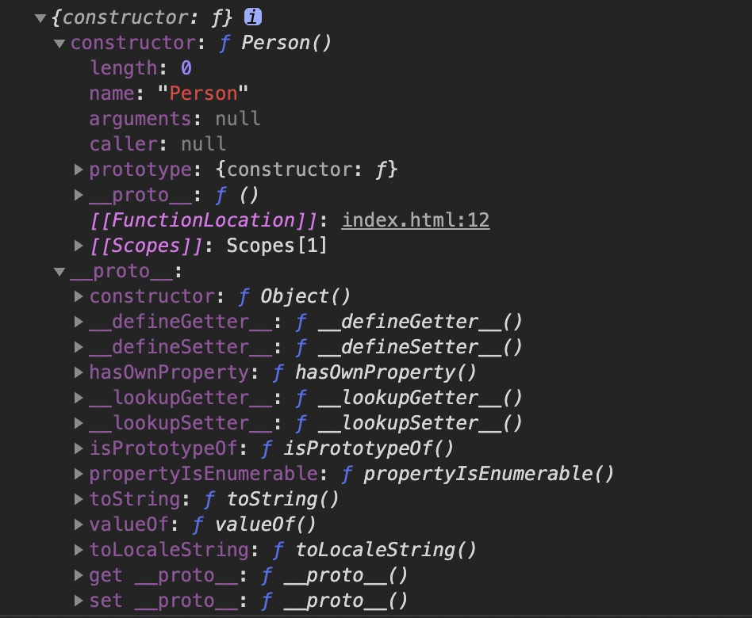
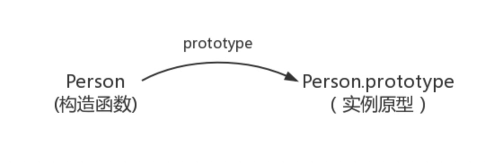
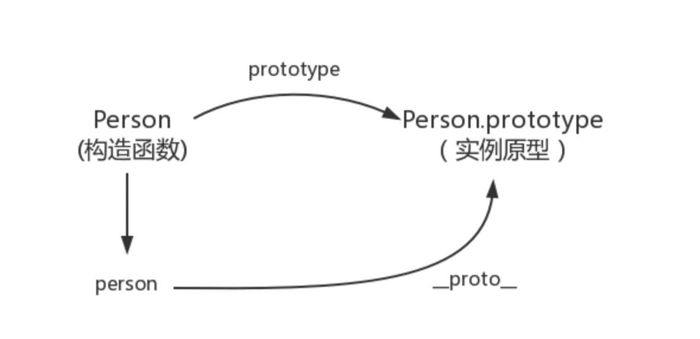
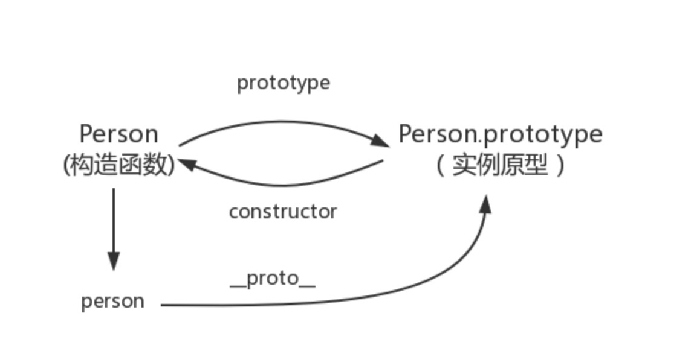
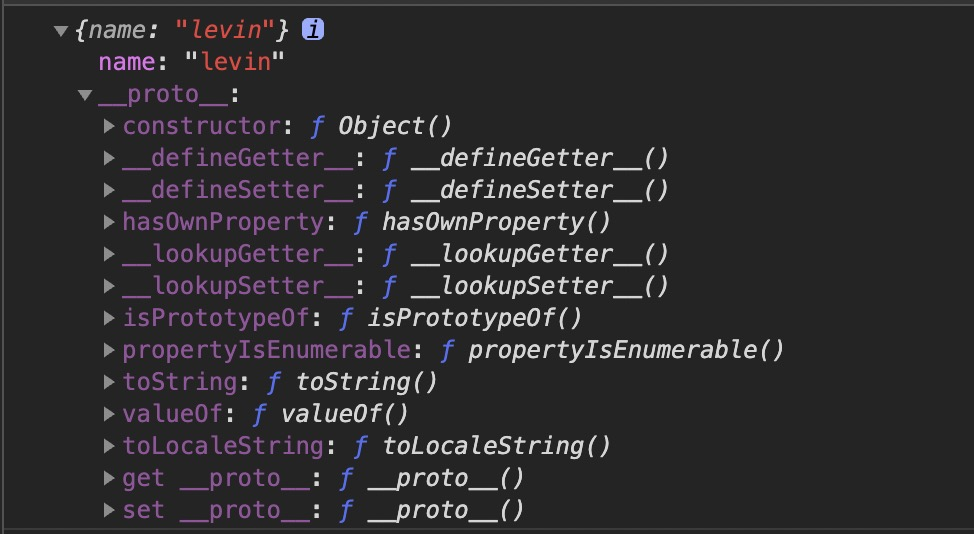
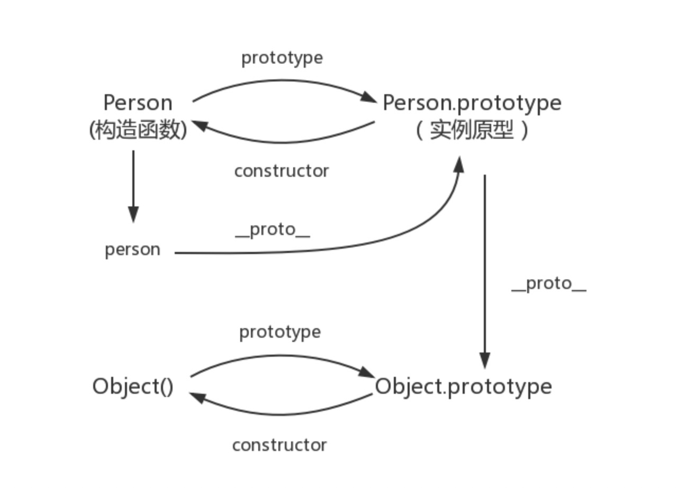
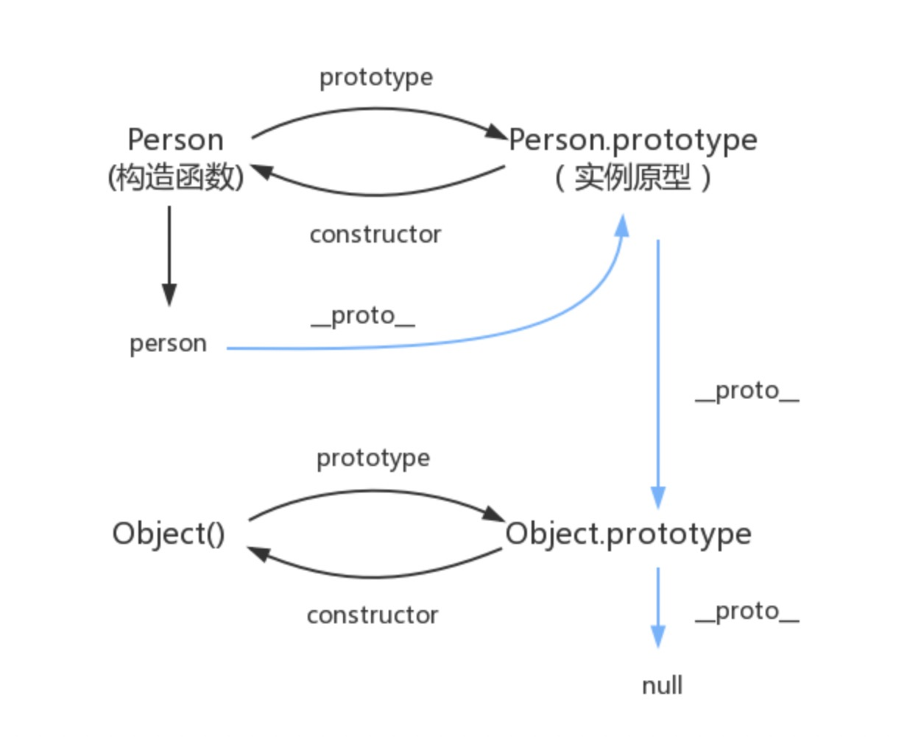

JavaScript是一种基于原型的语言，每个实例对象都拥有一个原型对象，该实例对象从原型对象继承方法和属性。原型对象可能也拥有原型，并从中继承方法和属性，层层向上直到一个对象的原型对象为 null，这种关系通常被称为原型链 (prototype chain)，这也是为何一个对象会拥有定义在其他对象中的属性和方法。

准确地说，这些属性和方法定义在Object的构造器函数(constructor functions)之上的prototype属性上，而非对象实例本身。

从 ECMAScript 6 开始，[[Prototype]] 可以通过 Object.getPrototypeOf() 和 Object.setPrototypeOf() 访问器来访问。这个等同于 JavaScript 的非标准但许多浏览器实现的属性 __proto__。

下面就开始我们的原型到原型链之旅吧～～

### 构造函数

通过 new 函数名  来实例化对象的函数叫构造函数。任何的函数都可以作为构造函数存在。构造函数的主要功能是初始化对象，需要和new一起使用。

```
function Person() {

}
var person = new Person();
person.name = 'levin';
console.log(person.name) // levin
```

### prototype

每一个JavaScript对象(null除外)在创建的时候就会与之关联另一个对象，即我们所说的原型，每一个对象都会从原型"继承"属性。

```
function Person(){}
console.log( Person.prototype );
```



每个函数(除了Function.prototype.bind())都有一个特殊的属性叫作原型（prototype），函数的 prototype 属性指向了一个对象，这个对象正是调用该构造函数而创建的实例的原型。也就是下面例子中的 person1 和 person2 的原型。

```
    function Person() {}
    Person.prototype.name = 'levin'  // prototype是函数才会有的属性
    let person1 = new Person()
    let person2 = new Person()
    console.log(person1.name) // levin
    console.log(person2.name) // levin
```

构造函数和实例原型之间的关系：



### Object.getPrototypeOf (__proto__)

Object.getPrototypeOf() 方法返回指定对象的原型（内部[[Prototype]]属性的值)。

__proto__是每一个JavaScript对象(除了 null )的内置属性，这个属性会指向该对象的原型。

```
function Person() {}
let person = new Person();
console.log(Object.getPrototypeOf(person) === Person.prototype);  // true
console.log(person.__proto__ === Person.prototype); // true
```
构造函数和实例原型之间的关系：



### constructor

每个原型都有一个 constructor 属性指向关联的构造函数
```
function Person() {}
console.log(Person === Person.prototype.constructor); // true
```



**下面的关系要记住(构造函数、实例原型、和实例之间的关系)：**
```
function Person() {

}

let person = new Person();

console.log(Object.getPrototypeOf(person) === Person.prototype) // true
console.log(person.__proto__ == Person.prototype) // true
console.log(Person.prototype.constructor == Person) // true
```

补充：
一旦我们改变了函数的 prototype ，那么新对象就没有这个属性了（当然可以通过原型链取到 constructor）

```
function Person() {}
// Person.prototype.name = 'levin';
Person.prototype = { name: 'levin' };
console.log(Person.prototype)
```



constructor作用说明：
- 让实例对象知道是什么函数构造了它
- 如果想给某些类库中的构造函数增加一些自定义的方法，就可以通过 xx.constructor.method 来扩展

### 实例与原型

当读取实例的属性时，如果找不到，就会查找与对象关联的原型中的属性，如果还查不到，就去找原型的原型，一直找到最顶层为止。

```
    function Person() {}

    Person.prototype.name = "levin";
    let person = new Person();
    person.name = "leon";
    console.log(person.name); // leon
    delete person.name;
    console.log(person.name); // levin
```

### 原型的原型

```
// 原型对象就是通过 Object 构造函数生成的
let obj = new Object();
obj.name = 'levin'
console.log(obj.name) // levin
```



### 原型链

Object.prototype 的原型 null?

```
console.log(Object.prototype.__proto__ === null) // true
```
null 表示“没有对象”，即该处不应该有值。

所以查找对象继承的属性时，层层向上直到一个对象的原型对象为 null 就结束了。由相互关联的原型组成的链状结构就是原型链。



### 其他

#### 1. constructor

```
function Person() {

}
var person = new Person();
console.log(person.constructor === Person); // true
```

当获取 person.constructor 时，其实 person 中并没有 constructor 属性,当不能读取到constructor 属性时，会从 person 的原型也就是 Person.prototype 中读取，正好原型中有该属性，所以：
```
person.constructor === Person.prototype.constructor
```

#### 2.__proto__

绝大部分浏览器都支持这个非标准的方法__proto__访问原型，然而它并不存在于 Person.prototype 中，实际上，它是来自于 Object.prototype ，与其说是一个属性，不如说是一个 getter/setter，当使用 obj.__proto__ 时，可以理解成返回了 Object.getPrototypeOf(obj)。

#### 3.真的是继承吗

继承意味着复制操作，然而 JavaScript 默认并不会复制对象的属性，相反，JavaScript 只是在两个对象之间创建一个关联，这样，一个对象就可以通过委托访问另一个对象的属性和函数，所以与其叫继承，委托的说法反而更准确些。

参考：
- https://github.com/mqyqingfeng/Blog/issues/2
- https://developer.mozilla.org/zh-CN/docs/Learn/JavaScript/Objects/Object_prototypes
