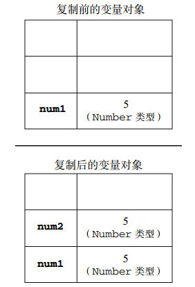
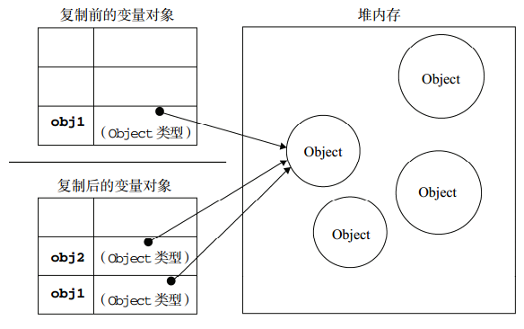

### 基本类型和引用类型

JS中的基本类型数据存放在栈内存中，复制的时候是值传递，但是引用类型的数据存放在堆内存中，栈内存中只存放具体的地址值，把object1赋值给object2的时候是把object1的地址值赋值给了object2，这个时候两个对象同时指向堆内存中的同一数据。




### 深拷贝和浅拷贝的区别

当对象是引用类型的时候，浅拷贝只复制地址值，实际上还是指向同一堆内存中的数据，深拷贝则是重新创建了一个相同的数据，二者指向的堆内存的地址值是不同的。深拷贝修改赋值前的变量数据不会影响赋值后的变量。

### 数组的浅拷贝

Array的slice和concat方法不修改原数组，只会返回一个浅复制了原数组中的元素的一个新数组。

如果数组元素是基本类型，就会拷贝一份，互不影响，而如果是对象或者数组，就会只拷贝对象和数组的引用，这样我们无论在新旧数组进行了修改，两者都会发生变化。

### 数组的深拷贝

JSON对象stringify方法可以将JS对象序列化成JSON字符串，parse方法可以将JSON字符串反序列化成JS对象，借助这两个方法，可以实现数组的深拷贝，而且同样适用于对象(有要求限制)

### 具有局限性的深拷贝

当对象或者数组内部的都是基本数据类型的话，以下的方式可以实现深拷贝。但是如果出现了引用类型嵌套引用类型的话。以下方法将不可用。

- es6解析结构 「...」
- Object.assign()
- 数组中的slice() & concat()

### 实现一个浅拷贝

上面三个方法 concat、slice、JSON.stringify 都算是技巧类，可以根据实际项目情况选择使用，接下来我们思考下如何实现一个对象或者数组的浅拷贝，其实就是遍历对象，然后把属性和属性值都放在一个新的对象。

```
var shallowCopy = function(obj) {
    // 只拷贝对象
    if (typeof obj !== 'object') return;
    // 根据obj的类型判断是新建一个数组还是对象
    var newObj = obj instanceof Array ? [] : {};
    // 遍历obj，并且判断是obj的属性才拷贝
    for (var key in obj) {
        if (obj.hasOwnProperty(key)) {
            newObj[key] = obj[key];
        }
    }
    return newObj;
}
```

### 实现一个深拷贝

```
var deepCopy = function(obj) {
    if (typeof obj !== 'object') return;
    var newObj = obj instanceof Array ? [] : {};
    for (var key in obj) {
        if (obj.hasOwnProperty(key)) {
            newObj[key] = typeof obj[key] === 'object' ? deepCopy(obj[key]) : obj[key];
        }
    }
    return newObj;
}
```

尽管使用深拷贝会完全的克隆一个新对象，不会产生副作用，但是深拷贝因为使用递归，性能会不如浅拷贝。
在实际的生产当中，还是推荐使用的lodash。

深入研究请看:

- https://juejin.im/post/5bc1ae9be51d450e8b140b0c
- https://github.com/mqyqingfeng/Blog/issues/32
- https://segmentfault.com/a/1190000015042902
- https://github.com/yygmind/blog/issues/29
